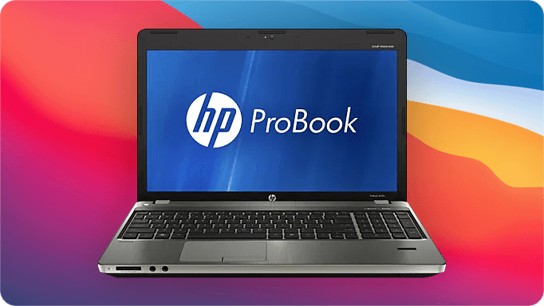
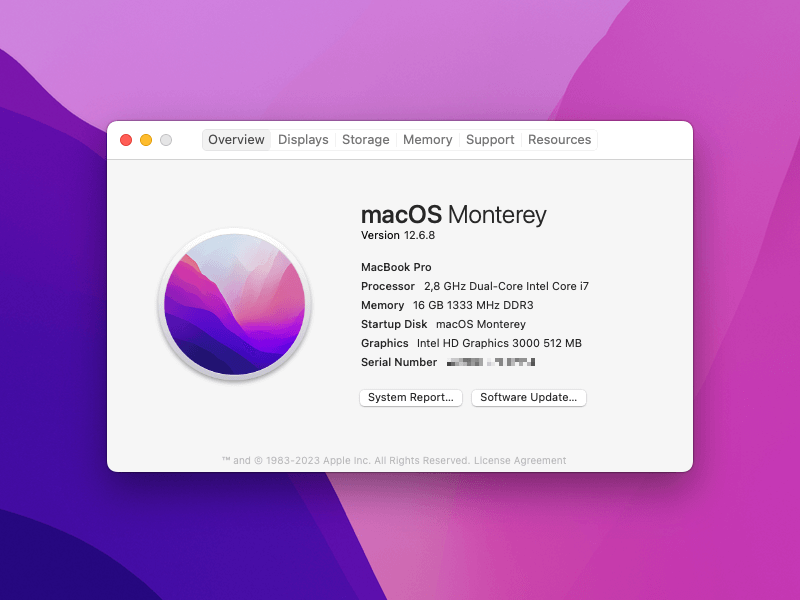
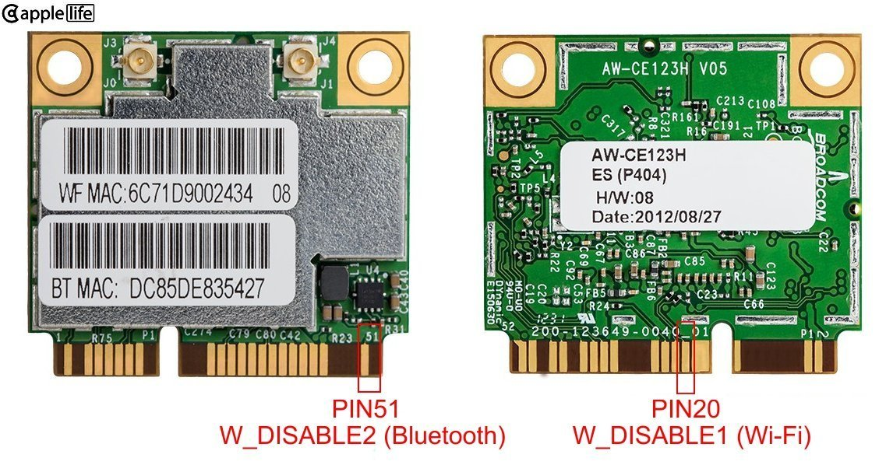

<p align="center"></p>
<h1 align="center">ProBook 4x30s OpenCore</h1>
<h3 align="center">4330s / 4530s / 4730s</h3>

Detailed instructions on how to install recent version of [macOS](https://en.wikipedia.org/wiki/MacOS) on HP ProBook 30s series laptops with second generation Sandy Bridge Intel Core i CPUs, – specifically, a [ProBook 4530s](https://support.hp.com/us-en/product/hp-probook-4530s-notebook-pc/5060880). This is also a long-overdue update to a previous guide posted here now with proper ACPI patches, important corrections and recommendations.



> [!IMPORTANT]
> An [expanded guide](https://github.com/ubihazard/probook-4x40s-oc "macOS for ProBook 4x40s") for 40s series laptops with third generation Intel Ivy Bridge CPUs and Metal-capable graphics is now available with much better support for modern macOS.

> [!NOTE]
> In the process some little adjustments for your particular laptop will need to be made because ProBooks shipped in many different configurations. Therefore it is highly recommended that you read the official OpenCore [install guide](https://dortania.github.io/OpenCore-Install-Guide/ "OpenCore install guide") first to get familiar with the process. That will make it much easier for you to adapt this guide as you progress.

Also note that only models with integrated Intel HD 3000 graphics are supported by this guide. Laptops with AMD GPUs require additional steps to [turn their discrete GPU off](#disabling-dedicated-gpu), which is not supported by macOS.

Despite effort was made to ensure all steps are as easy to follow and clear as possible, the process is not straightforward and a certain level of skill, experience with command line, patience, and ability to troubleshoot are a must. A complete OpenCore [EFI folder](https://github.com/ubihazard/probook-4x30s-oc/releases/latest "Download") is available for your reference.

Introduction
------------

ProBook 4530s is an old laptop from Sandy Bridge era made by HP. With a handful of [aftermarket upgrades](Guide/1.&#32;Upgrading&#32;Your&#32;ProBook.md) it can still make a powerful machine for simple daily tasks. More importantly, even in stock condition it is fairly compatible with macOS. So this is what we are going to do – putting macOS on it by means of [OpenCore](https://github.com/acidanthera/OpenCorePkg) bootloader and a collection of [kernel extensions](#kernel-extensions) made by talented individuals from hackintosh community.

So this is the configuration[^1] we are going to work with:

| **Name**     | Description
| ------------ | -----------
| **CPU**      | Intel Core i7-2640M
| **GPU**      | Intel HD 3000
| **RAM**      | 16 GB DDR3
| **Storage**  | 512 GB SATA SSD
| **Ethernet** | Realtek RTL8111
| **Wireless** | Atheros AR9285
| **USB 3.0**  | NEC Renesas uPD720200
| **Card reader** | JMicron JMB38X
| **Optical drive** | HP DVD-RW AD-7740H
| **macOS**    | Monterey 12.7.6
| **OpenCore** | [1.0.6-0cc8c81](https://github.com/ubihazard/OpenCorePkg-ProBook/releases/tag/v1.0.6-0cc8c81) for legacy ProBook
| **OCLP** | [2.4.1](https://github.com/dortania/OpenCore-Legacy-Patcher/releases/tag/2.4.1)

[^1]: Webcam works up to Mojave. USB 3.0 works up to Catalina. USB 2.0, Bluetooth and webcam need proper [USB port mapping](#fixing-usb). SD card reader might have issues past Monterey.

Although this laptop is very old, macOS works surprisingly well on it with pretty much full compatibility. You can expect relatively smooth web browsing experience, word processing, and coding light projects in VS Code (nothing too demanding). Don‘t expect running XCode with iOS simulator on it though. It can also help you manage your iThings if you don‘t already have a Mac.

OpenCore for Legacy ProBook
---------------------------

This guide now uses a [custom build](https://github.com/ubihazard/OpenCorePkg-ProBook/releases) of OpenCore put together by me specifically for use with legacy ProBook laptops. It includes two EFI modules for ProBook 4x30s: BIOS fan reset and BIOS Wi-Fi whitelist bypass.

  * `ProBookFanReset.efi` resets fan control from macOS back to automatic BIOS management. This needs to be done every time after using quiet fan patch to restore embedded controller state, and the best place to do it is during boot up.

  * `ProBookWifiUnblock.efi` is necessary if you plan to install a [non-whitelisted](#broadcom-wireless) (not approved by HP) Wi-Fi card in your ProBook 4x30s laptop. Thankfully, this module *is not needed* for 4x40s because in an unusual move by HP they did not cripple 40s series laptops with a BIOS Wi-Fi whitelist.

> [!IMPORTANT]
> **Do not use these EFI modules with any other laptop other than ProBook 30s or 40s series. Doing so can brick your device!**

Converting from Clover
----------------------

Note that Clover and OpenCore don’t mix well together. In my experience a NVRAM reset is required when switching from Clover to OpenCore, or the kernel might panic with weird error message during boot. If you’ve been using Clover previously, make sure to perform a NVRAM reset on your first OpenCore boot. This can be done from OpenCore boot menu screen: press space to reveal the corresponding hidden menu entry.

Kernel Extensions
-----------------

Or “kexts” are equivalent of “drivers” in Windows and are required for proper hardware support by macOS. Most of the important kernel extensions come preloaded with operating system, but the nature of hackintosh requires additional kexts to be added for certain devices which aren’t natively supported by macOS because they aren’t found in actual Macs made by Apple, such as network cards, SD card readers, and trackpads in case of laptops.

All required kexts are already assembled in one place in the provided OpenCore [EFI folder](https://github.com/ubihazard/probook-4x30s-oc/releases/latest). Though you might need to disable some and enable others to adjust for your own laptop configuration. This is done during the [post-install](#post-install) stage.

Installation
------------

Follow the official Dortania install guide to [make bootable macOS USB installer](https://dortania.github.io/OpenCore-Install-Guide/installer-guide/). After creating USB installer mount its EFI partition and copy OpenCore files downloaded from [releases page](https://github.com/ubihazard/probook-4x30s-oc/releases/latest "Download"). Replace `config.plist` with `config-usb.plist`. It‘s a configuration variant modified specifically to use with macOS installer that disables some kexts which are useless during setup process (Wi-Fi, Bluetooth, SD card reader, etc.), doesn’t modify SIP flags or mess with AMFI, enables verbose boot text messages so you can troubleshoot boot issues, and has a different SMBIOS Mac model which allows to install more recent macOS versions which aren’t supported natively, but supported by [OpenCore Legacy Patcher](https://github.com/dortania/OpenCore-Legacy-Patcher) (OCLP), – up to Monterey with the provided OpenCore configuration.

### HD+ and Full HD Screens

If you own a 4730s model ProBook with HD+ 1600x900 screen or replaced your 4530s stock LCD panel with a full HD one, an additional iGPU device parameter must be set to enable proper operation of your laptop screen. Add the following under `DeviceProperties/Add/PciRoot(0x0)/Pci(0x2,0x0)` section for both regular and USB version of `config.plist` before beginning the setup process:

```xml
<key>AAPL00,DualLink</key>
<data>AQAAAA==</data>
```

### Resetting Power Management

Unless your ProBook already comes with a Core i7-2640M, like mine, you need to disable CPU power management for your very first setup. This step is required for legacy Intel CPUs such as used in Sandy Bridge and Ivy Bridge ProBooks.

  * Open `config.plist` copied to EFI partition on a USB drive. Disable the `SSDT-PM.aml` ACPI table: under `ACPI/Add` set `Enabled` to `false`.

    <details>
    <summary><strong>Example</strong></summary><br>
    
    ```xml
    <dict>
      <key>Comment</key>
      <string>Core i7-2640M power management</string>
      <key>Enabled</key>
      <false/>
      <key>Path</key>
      <string>SSDT-PM.aml</string>
    </dict>
    ```
    </details>

  * Drop OEM CPU tables: under `ACPI/Delete` set `Enabled` to `true`.

    <details>
    <summary><strong>Example</strong></summary><br>
    
    ```xml
    <key>Delete</key>
    <array>
      <dict>
        <key>All</key>
        <false/>
        <key>Comment</key>
        <string>Delete CpuPm</string>
        <key>Enabled</key>
        <true/>
        <key>OemTableId</key>
        <data>Q3B1UG0AAAA=</data>
        <key>TableLength</key>
        <integer>0</integer>
        <key>TableSignature</key>
        <data>U1NEVA==</data>
      </dict>
      <dict>
        <key>All</key>
        <false/>
        <key>Comment</key>
        <string>Delete Cpu0Ist</string>
        <key>Enabled</key>
        <true/>
        <key>OemTableId</key>
        <data>Q3B1MElzdAA=</data>
        <key>TableLength</key>
        <integer>0</integer>
        <key>TableSignature</key>
        <data>U1NEVA==</data>
      </dict>
    </array>
    ```
    </details>

  * Enable `NullCPUPowerManagement.kext`: under `Kernel/Add` set `Enabled` to `true`.

    <details>
    <summary><strong>Example</strong></summary><br>
    
    ```xml
    <dict>
      <key>Arch</key>
      <string>Any</string>
      <key>BundlePath</key>
      <string>NullCPUPowerManagement.kext</string>
      <key>Comment</key>
      <string>NullCPUPowerManagement.kext</string>
      <key>Enabled</key>
      <true/>
      <key>ExecutablePath</key>
      <string>Contents/MacOS/NullCPUPowerManagement</string>
      <key>MaxKernel</key>
      <string></string>
      <key>MinKernel</key>
      <string></string>
      <key>PlistPath</key>
      <string>Contents/Info.plist</string>
    </dict>
    ```
    </details>

We will [re-enable](#restoring-power-management) proper CPU power management during a post-install step later.

### What macOS Version to Install

A few notes on what macOS to choose for installation. Typically, the recommended macOS version to install is Big Sur. It is modern enough for everyday use and has decent software support, including modern browser (Firefox is recommended due to much longer support of older macOS than Chrome).

Mojave and everything older is *not recommended* due to being way too outdated and having no modern browser support making it difficult just to get on the Internet. Catalina and Mojave also aren‘t supported well by OCLP, which is required to restore legacy HD 3000 graphics acceleration.

However, if you managed to find and swapped in a compatible Broadcom Wi-Fi card, you can bump installed macOS version to Monterey. The caveat is that support for Bluetooth on these cards (any compatible card you can install in this laptop) on Monterey is sketchy at best: Airdrop, Handoff, and certain Continuity features might not work at all, would work but with issues, or only in one direction (from iPhone to ProBook, but not the other way around).

### Installing macOS Ventura

macOS Ventura requires a CPU with AVX2 instructions which all Sandy Bridge and Ivy Bridge CPUs lack. (AVX2 becomes available since Haswell.) Thus, Monterey is the final version of macOS you can *technically* install on this laptop.

Using [CryptexFixup](https://github.com/acidanthera/CryptexFixup) kext, which enables sort of AVX2 emulation, it is possible to install macOS Ventura (and even later macOS, all the way up to Sequoia). However, this isn‘t supported by this guide and is *not recommended*. macOS past Monterey increasingly rely high on Metal API in various places and bundled applications, and using non-metal GPU can be a real pain on such system. Also keep in mind that pretty much any third-party app designed to run on Ventura would expect AVX2 to be available and likely to experience random crashes due to lack thereof.

So this, in my opinion, remains an option only for maniacs willing to accomplish just this task of “successfully” running Ventura on an unsupported Sandy Bridge system, – for bragging rights.

Anyway, reboot your ProBook from created USB. During setup the machine will restart several times and if everything goes well (and it should) you will end up on macOS welcome screen. To finish setup we need to copy OpenCore files to your system EFI partition (so you can boot without USB) and fix power management. This time, however, keep the `config.plist` from the provided OpenCore [EFI folder](https://github.com/ubihazard/probook-4x30s-oc/releases/latest "Download"), not `config-usb.plist`. The next step requires you to have working internet connection so hook your laptop up with an ethernet cable because Wi-Fi isn’t available yet.

ACPI Patching
-------------

ACPI patches, like kexts, are required for basic functionality of your ProBook in macOS. You can’t skip this section. Most ACPI patches for this laptop (and other ProBooks, EliteBooks, and ZBooks) were made by legendary [RehabMan](https://github.com/RehabMan/HP-ProBook-4x30s-DSDT-Patch) and then simply ported by me to work with OpenCore bootloader using his [patched DSDT](https://github.com/ubihazard/probook-4x40s-oc/ACPI/RehabMan/4x40s_IvyBridge.txt) and hot patch guide as sources. Other SSDTs are provided by Dortania in their [Sandy Bridge laptop guide](https://dortania.github.io/OpenCore-Install-Guide/config-laptop.plist/sandy-bridge.html "Sandy Bridge laptop guide").

These patches are compatible across all 30s series laptops regardless of configuration and can be used as is. What‘s left is restoring proper CPU power management (for exact processor installed in your ProBook) and ensure correct USB port mapping. If your laptop comes with discrete AMD GPU and you *don’t* want to turn it off in BIOS (to keep it available for other OSes), an additional DSDT patch is needed to turn it off exclusively in macOS.

### Restoring Power Management

Legacy CPU power management is enabled with the help of `SSDT-PM.aml` ACPI table. This table is specific to each CPU and because ProBooks came with different processors it has to be generated yourself.

Without proper CPU PM `AppleIntelCPUPowerManagement.kext` would cause kernel panic at boot so `NullCPUPowerManagement.kext` is used (in USB `config.plist`) to overtake control from it temporarily.

  * Follow the Dortania [guide](https://dortania.github.io/OpenCore-Post-Install/universal/pm.html#sandy-and-ivy-bridge-power-management) to create PM table for the CPU installed in your laptop.

  * Mount your EFI system partition (replace `X` and `Y` with your EFI disk identifier, it will likely be `disk0s1`):

    ```bash
    diskutil list
    sudo diskutil mount diskXsY
    ```

  * Copy the `ssdt.aml` generated by [ssdtPRGen.sh](https://github.com/Piker-Alpha/ssdtPRGen.sh) script from Piker-Alpha to your EFI ACPI folder:

    ```bash
    cp ~/Library/ssdtPRGen/ssdt.aml /Volumes/EFI/EFI/OC/ACPI/SSDT-PM.aml
    ```

  * Re-enable CPU power management in `config.plist`: under `ACPI/Add` set `Enabled` to `true`.

    <details>
    <summary><strong>Example</strong></summary><br>
    
    ```xml
    <dict>
      <key>Comment</key>
      <string>SSDT-PM.aml</string>
      <key>Enabled</key>
      <true/>
      <key>Path</key>
      <string>SSDT-PM.aml</string>
    </dict>
    ```
    </details>

  * Restore OEM CPU tables: under `ACPI/Delete` set `Enabled` to `false`.

    <details>
    <summary><strong>Example</strong></summary><br>
    
    ```xml
    <key>Delete</key>
    <array>
      <dict>
        <key>All</key>
        <false/>
        <key>Comment</key>
        <string>Delete CpuPm</string>
        <key>Enabled</key>
        <false/>
        <key>OemTableId</key>
        <data>Q3B1UG0AAAA=</data>
        <key>TableLength</key>
        <integer>0</integer>
        <key>TableSignature</key>
        <data>U1NEVA==</data>
      </dict>
      <dict>
        <key>All</key>
        <false/>
        <key>Comment</key>
        <string>Delete Cpu0Ist</string>
        <key>Enabled</key>
        <false/>
        <key>OemTableId</key>
        <data>Q3B1MElzdAA=</data>
        <key>TableLength</key>
        <integer>0</integer>
        <key>TableSignature</key>
        <data>U1NEVA==</data>
      </dict>
    </array>
    ```
    </details>

  * Disable `NullCPUPowerManagement.kext`: under `Kernel/Add` set `Enabled` to `false`.

    <details>
    <summary><strong>Example</strong></summary><br>
    
    ```xml
    <dict>
      <key>Arch</key>
      <string>Any</string>
      <key>BundlePath</key>
      <string>NullCPUPowerManagement.kext</string>
      <key>Comment</key>
      <string>NullCPUPowerManagement.kext</string>
      <key>Enabled</key>
      <false/>
      <key>ExecutablePath</key>
      <string>Contents/MacOS/NullCPUPowerManagement</string>
      <key>MaxKernel</key>
      <string></string>
      <key>MinKernel</key>
      <string></string>
      <key>PlistPath</key>
      <string>Contents/Info.plist</string>
    </dict>
    ```
    </details>

If you went with Monterey make sure `ASPP-Override.kext` is enabled too, because it is required to restore legacy CPU power management which was at some point removed in Monterey:

<details>
<summary><strong>Example</strong></summary><br>

```xml
<dict>
  <key>Arch</key>
  <string>Any</string>
  <key>BundlePath</key>
  <string>ASPP-Override.kext</string>
  <key>Comment</key>
  <string>ASPP-Override.kext</string>
  <key>Enabled</key>
  <true/>
  <key>ExecutablePath</key>
  <string></string>
  <key>MaxKernel</key>
  <string></string>
  <key>MinKernel</key>
  <string>21.4.0</string>
  <key>PlistPath</key>
  <string>Contents/Info.plist</string>
</dict>
```
</details>

### Disabling Dedicated GPU

For laptop configurations with dedicated GPU soldered onto motherboard an additional step of disabling (or “turning off”) of this unsupported GPU is needed. Unfortunately, I did not have a 30s series laptop with dGPU on hand, so I can’t provide direct instructions for ProBook 4530s exactly. I did, however, have an Ivy Bridge 4540s with Radeon dGPU, and because it is very similar with 4530s in terms of ACPI configuration, you can grab my [dGPU off patch](https://github.com/ubihazard/probook-4x40s-oc/Guide/Disabling&#32;Radeon.md) for 4540s and adapt it for 4530s quite easily.

Alternatively, `-wegnoegpu` [WhateverGreen boot argument](https://github.com/acidanthera/WhateverGreen "WhateverGreen configuration") can be used temporarily in `config.plist` while you are working on a real patch:

```xml
<key>boot-args</key>
<string>... -wegnoegpu</string>
```

Notice that this is *not* a proper patch because it does not actually turn the discrete GPU off so it doesn’t consume power, – it merely hides it from macOS so it doesn’t cause conflict and boot issues. And power consumption is very important, especially in a laptop. A GPU without drivers loaded for it will run with no power saving features enabled and will consume lots of power and overheat for no reason.

Or simply disable dGPU in your laptop‘s BIOS, – although in this case it would obviously also no longer be available in other operating systems, not just macOS. On the other hand this approach is definitely the easiest.

### Fixing USB

The USB port map kext in this repo is for ProBook 4530s models with USB 3.0 port. If you have a different mainboard (such as with all USB 2.0 ports only) or if port mapping doesn‘t match for some other reason, you would have to re-map your USB ports by means of creating your own version of `USBMap.kext` while still booted from USB. This procedure is fully covered in Dortania [guide](https://dortania.github.io/OpenCore-Post-Install/usb/ "USB port mapping guide") and I won‘t be duplicating it here. Using @corpnewt [USBMap](https://github.com/corpnewt/USBMap) is the route you want to take. Otherwise, jump to the next step.

Post-install
------------

We still got stuff to do to make the system usable. Unless you decided to install very old macOS version for some reason, e.g. High Sierra, you’d be stuck without hardware graphics acceleration and, as a result, very slow and unusable user interface. This and other stuff, like Wi-Fi, is fixed in this step.

### Quick Note on APFS

OpenCore from the provided EFI folder will load any APFS driver available. This is done to make initial setup easier in case of multiple macOS installations (e.g. High Sierra together with Big Sur). For security reasons, it is recommeded that after installation you would [change](https://dortania.github.io/OpenCore-Install-Guide/config-laptop.plist/sandy-bridge.html#apfs) the minimum allowed APFS driver version according to the latest macOS version you have installed. For Big Sur and above, leave both `MinVersion` and `MinDate` at `0`.

### Disabling SIP and AMFI

Due to extensive modifications required to support this laptop on modern macOS it is better to disable both SIP and AMFI right away in `NVRAM/Add/7C436110-AB2A-4BBB-A880-FE41995C9F82` (the configured value is `0x803`):

```xml
<key>csr-active-config</key>
<data>AwgAAA==</data>
```

AMFI is disabled via `boot-args`:

```xml
<key>boot-args</key>
<string>... amfi=0x80 amfi_get_out_of_my_way=1 ...</string>
```

These modifications are already done in provided `config.plist`. I’m just making it obvious here.

### Restoring Graphics Acceleration

One of the first [post-installation](https://dortania.github.io/OpenCore-Post-Install/ "Post-installation guide") tasks you will have to perform, unless you decided to stay on High Sierra, is restoring graphics acceleration along with native desktop resolution.

Intel HD 3000 doesn‘t support Metal graphics acceleration API used by macOS since El Capitan. And since Mojave, HD 3000 itself isn‘t supported at all: you need to use [OpenCore Legacy Patcher](https://github.com/dortania/OpenCore-Legacy-Patcher "OCLP") to install patched kexts that restore graphics acceleration and work-around lack of Metal requirement.

Reboot without USB installer (this is important because USB config doesn’t use proper SMBIOS model and doesn’t disable SIP and AMFI required for patcher to work), download the patcher and allow it to install root patches. Reboot one more time and you should be greeted by a proper desktop in glorious native resolution.

Note that patcher only enables macOS graphical interface to function properly (mostly). Applications, such as iWork suite or Microsoft Office, that *do* use Metal cannot be worked around but can be replaced with their older non-Metal versions. Usually they work on Big Sur and Monterey just fine.

There’s additional information about [Intel HD 3000 graphics](Guide/2.&#32;HD&#32;3000&#32;Issues.md) that you need to be aware of.

### Fixing Blur Effects in Big Sur and Monterey

In Big Sur transparent effects, such as blur, render incorrectly on non-Metal GPUs (HD 3000 is not capable of Metal API). After installing [patched graphics kexts](#restoring-graphics-acceleration) with OCLP it becomes possible to fall back to legacy blur drawing method:

```bash
defaults write -g Moraea_BlurBeta -bool true
```

You might also experiment with different blur strength, style of dark window borders, and dark menu bar text:

```bash
defaults write -g ASB_BlurOverride -float 30
defaults write -g Moraea_RimBeta -bool true
defaults write -g Moraea_DarkMenuBar -bool true
```

In Monterey you can get noticeable performance improvement by enabling reduced transparency mode in Accessibility settings. (This mode is broken on Big Sur with patched kexts, unfortunately, rendering the menu bar unusable.) With this on, you can now selectively re-enable transparency and blur only for the Dock:

```bash
defaults write com.apple.dock Moraea_EnableTransparency 1
```

Log out and back in to apply the changes. Some of these [commands](https://moraea.github.io/Docs/defaults.html), like `Moraea_EnableTransparency`, require a reboot to be applied.

### Enabling Wi-Fi and Bluetooth

By default Atheros wireless is already configured in `config.plist`. You can verify that the following kexts are enabled (`Enabled` -> `true`):

  * `IOath3kfrmwr.kext`,
  * `Legacy/IOath3kfrmwr.kext`,
  * `IOath3kdevice.kext`,
  * `HS80211Family.kext`,
  * `AirPortAtheros40.kext`,
  * `ProBookAtheros.kext`
  * `WifiLocFix.kext`.

<details>
<summary><strong>Example</strong></summary><br>

```xml
...
<dict>
  <key>Arch</key>
  <string>Any</string>
  <key>BundlePath</key>
  <string>AirPortAtheros40.kext</string>
  <key>Comment</key>
  <string>AirPortAtheros40.kext</string>
  <key>Enabled</key>
  <true/>
  <key>ExecutablePath</key>
  <string>Contents/MacOS/AirPortAtheros40</string>
  <key>MaxKernel</key>
  <string>20.9.9</string>
  <key>MinKernel</key>
  <string>18.0.0</string>
  <key>PlistPath</key>
  <string>Contents/Info.plist</string>
</dict>
...
```
</details>

Optional: open `WifiLocFix.kext/Contents/Info.plist` in a plain text editor and change the country code (`US`) and locale (`FCC` or `ETSI` for Europe):

```xml
<dict>
  <key>IO80211CountryCode</key>
  <string>US</string>
  <key>IO80211Locale</key>
  <string>FCC</string>
</dict>
```

If you opted to install Broadcom card in your ProBook head over to a [dedicated section](#enabling-broadcom-wireless) for your wireless configuration.

### Configuring Trackpad

Since your laptop battery is probably long dead, macOS would not recognize it. And without a recognized battery modern versions of macOS also prevent changing trackpad settings (go figure).

In reality the trackpad is fully working, – you just can’t access its settings. In order to configure it you would have to manually edit the binary `.plist` file at `~/Library/Preferences/com.apple.AppleMultitouchTrackpad.plist`.

Copy it to your desktop and convert it from binary format to XML:

```bash
cd ~/Dekstop
cp ~/Library/Preferences/com.apple.AppleMultitouchTrackpad.plist ./
plutil -convert xml1 com.apple.AppleMultitouchTrackpad.plist
```

Make your edits (make sure the syntax is correct) and convert the XML config back into binary format:

```bash
nano com.apple.AppleMultitouchTrackpad.plist
plutil -convert binary1 com.apple.AppleMultitouchTrackpad.plist
```

Replace the original file with your edited copy:

```bash
cp com.apple.AppleMultitouchTrackpad.plist ~/Library/Preferences/
```

*Rebooting is required to make it work.* Assuming you also didn‘t make any mistakes while editing the file.

A pre-made trackpad configuration file with tap to click is [provided](/Library/Preferences/com.apple.AppleMultitouchTrackpad.plist "Trackpad config") and should suit most users well. Copy it to `~/Library/Preferences` replacing the original, if you can’t bother editing your own.

### Filling Your System Information

The final step to setting up your new hackintosh laptop is generating unique serial number and system UUID. You can skip this step if you don‘t plan to use App store or connect with Apple, otherwise it is required to make iCloud or iMessage to work.

First, you need to choose the Mac SMBIOS product name that resembles your hardware most closely. For this laptop model it would be `MacBookPro8,1`. If you opted to upgrade your ProBook with quad-core CPU (against [my advice](Guide/1.&#32;Upgrading&#32;Your&#32;ProBook.md#cpu)), `MacBookPro8,2` would be a preferred choice, but see a note below for USB port mapping adjustment. Now you can use `macserial` tool from OpenCore utilities to generate serials (`SystemSerialNumber` and `MLB`, or “motherboard serial number”):

```bash
./macserial -m 'MacBookPro8,1' -n 1
```

The system serial number you generated must be reported as “invalid” or “not found” on Apple [support coverage](https://checkcoverage.apple.com/ "Serial number check") page. If it comes back as “valid”, it means `macserial` somehow generated a number that belongs to an actual produced Mac, and you must generate another serial and check it again.

Next, find out your ethernet adapter MAC address and strip it of `:` characters, – this would be your `ROM` (it is better to pick wired interface MAC address rather than wireless):

```bash
ifconfig
```

Encode your `ROM` value in Base64:

```bash
echo AABBCCXXYYZZ | base64
```

Finally, generate the `SystemUUID` for your ProBook:

```bash
uuidgen
```

Now we can fill this information under `PlatformInfo/Generic`:

<details>
<summary><strong>Example</strong></summary><br>

```xml
<key>Generic</key>
<dict>
  <key>AdviseFeatures</key>
  <false/>
  <key>MLB</key>
  <string>M0000000000000001</string>
  <key>MaxBIOSVersion</key>
  <false/>
  <key>ProcessorType</key>
  <integer>0</integer>
  <key>ROM</key>
  <data>ABCDEF==</data>
  <key>SpoofVendor</key>
  <true/>
  <key>SystemMemoryStatus</key>
  <string>Auto</string>
  <key>SystemProductName</key>
  <string>MacBookPro8,1</string>
  <key>SystemSerialNumber</key>
  <string>W00000000001</string>
  <key>SystemUUID</key>
  <string>XXXXXXXX-XXXX-XXXX-XXXX-XXXXXXXXXXXX</string>
</dict>
```
</details>

> [!IMPORTANT]
> If you change your SMBIOS name for any reason `USBMap.kext` must be adjusted because it depends on it. Open `USBMap.kext/Contents/Info.plist` in a plain text editor and replace all instances of `MacBookPro8,1` with SMBIOS name of your choice.

### Firefox Not Starting on Monterey

Add `ipc_control_port_options=0` to `boot-args` config section:

```xml
<key>boot-args</key>
<string>-no_compat_check amfi_get_out_of_my_way=1 amfi=0x80 ipc_control_port_options=0</string>
```

Enabling Broadcom Wireless
--------------------------

As already [mentioned](#opencore-for-legacy-probook), ProBook 4530s suffers from a dreaded Wi-Fi BIOS whitelist preventing you from changing wireless adapter to a native Broadcom card. Fortunately, there’s a two-step solution to this problem. First, a simple hardware mod must be performed on a card itself.

### Hardware Mod

You will need to mask certain PCB contacts with tiny pieces of kapton tape to prevent HP firmware from turning the Wi-Fi module off. Without this mod only Bluetooth side will work.



> [!NOTE]
> This guide assumes you are using Broadcom BCM94352HMB, which is the best wireless module you can put in your ProBook laptop. If you’ve got another compatible Broadcom adapter the pin out might be different. In that case you need to find a datasheet for your card and determine where equivalent contacts are located.

### Configuration

Remove Atheros wireless kexts entries from `config.plist`:

  * `IOath3kfrmwr.kext`,
  * `Legacy/IOath3kfrmwr.kext`,
  * `IOath3kdevice.kext`,
  * `HS80211Family.kext`,
  * `AirPortAtheros40.kext`,
  * `ProBookAtheros.kext`,
  * `WifiLocFix.kext`.

Add the following kexts to `EFI/OC/Kexts` by copying them from [4x40s OC EFI folder](https://github.com/ubihazard/probook-4x40s-oc/releases/latest "40s series OpenCore EFI folder"):

  * `AirportBrcmFixup.kext` together with its plugins:
      * `AirPortBrcmNIC_Injector.kext`,
      * `AirPortBrcm4360_Injector.kext`,
  * `BlueToolFixup.kext`,
  * `BrcmBluetoothInjector.kext`,
  * `BrcmFirmwareData.kext`
  * `BrcmPatchRAM3.kext`.

Copy and paste the following section where Atheros configuration was previously:

<details>
<summary><strong>Broadcom wireless config</strong></summary><br>

```xml
<dict>
  <key>Arch</key>
  <string>Any</string>
  <key>BundlePath</key>
  <string>AirportBrcmFixup.kext</string>
  <key>Comment</key>
  <string>AirportBrcmFixup.kext</string>
  <key>Enabled</key>
  <true/>
  <key>ExecutablePath</key>
  <string>Contents/MacOS/AirportBrcmFixup</string>
  <key>MaxKernel</key>
  <string></string>
  <key>MinKernel</key>
  <string></string>
  <key>PlistPath</key>
  <string>Contents/Info.plist</string>
</dict>
<dict>
  <key>Arch</key>
  <string>Any</string>
  <key>BundlePath</key>
  <string>AirportBrcmFixup.kext/Contents/PlugIns/AirPortBrcmNIC_Injector.kext</string>
  <key>Comment</key>
  <string>AirPortBrcmNIC_Injector.kext</string>
  <key>Enabled</key>
  <true/>
  <key>ExecutablePath</key>
  <string></string>
  <key>MaxKernel</key>
  <string></string>
  <key>MinKernel</key>
  <string>20.0.0</string>
  <key>PlistPath</key>
  <string>Contents/Info.plist</string>
</dict>
<dict>
  <key>Arch</key>
  <string>Any</string>
  <key>BundlePath</key>
  <string>AirportBrcmFixup.kext/Contents/PlugIns/AirPortBrcm4360_Injector.kext</string>
  <key>Comment</key>
  <string>AirPortBrcm4360_Injector.kext</string>
  <key>Enabled</key>
  <true/>
  <key>ExecutablePath</key>
  <string></string>
  <key>MaxKernel</key>
  <string>19.9.9</string>
  <key>MinKernel</key>
  <string></string>
  <key>PlistPath</key>
  <string>Contents/Info.plist</string>
</dict>
<dict>
  <key>Arch</key>
  <string>Any</string>
  <key>BundlePath</key>
  <string>BlueToolFixup.kext</string>
  <key>Comment</key>
  <string>BlueToolFixup.kext</string>
  <key>Enabled</key>
  <true/>
  <key>ExecutablePath</key>
  <string>Contents/MacOS/BlueToolFixup</string>
  <key>MaxKernel</key>
  <string></string>
  <key>MinKernel</key>
  <string>21.0.0</string>
  <key>PlistPath</key>
  <string>Contents/Info.plist</string>
</dict>
<dict>
  <key>Arch</key>
  <string>Any</string>
  <key>BundlePath</key>
  <string>BrcmBluetoothInjector.kext</string>
  <key>Comment</key>
  <string>BrcmBluetoothInjector.kext</string>
  <key>Enabled</key>
  <true/>
  <key>ExecutablePath</key>
  <string></string>
  <key>MaxKernel</key>
  <string>20.9.9</string>
  <key>MinKernel</key>
  <string>18.0.0</string>
  <key>PlistPath</key>
  <string>Contents/Info.plist</string>
</dict>
<dict>
  <key>Arch</key>
  <string>Any</string>
  <key>BundlePath</key>
  <string>BrcmFirmwareData.kext</string>
  <key>Comment</key>
  <string>BrcmFirmwareData.kext</string>
  <key>Enabled</key>
  <true/>
  <key>ExecutablePath</key>
  <string>Contents/MacOS/BrcmFirmwareData</string>
  <key>MaxKernel</key>
  <string></string>
  <key>MinKernel</key>
  <string>19.0.0</string>
  <key>PlistPath</key>
  <string>Contents/Info.plist</string>
</dict>
<dict>
  <key>Arch</key>
  <string>Any</string>
  <key>BundlePath</key>
  <string>BrcmPatchRAM3.kext</string>
  <key>Comment</key>
  <string>BrcmPatchRAM3.kext</string>
  <key>Enabled</key>
  <true/>
  <key>ExecutablePath</key>
  <string>Contents/MacOS/BrcmPatchRAM3</string>
  <key>MaxKernel</key>
  <string></string>
  <key>MinKernel</key>
  <string>19.0.0</string>
  <key>PlistPath</key>
  <string>Contents/Info.plist</string>
</dict>
```
</details>

For Mojave and earlier copy `BrcmPatchRAM2.kext` and `BrcmFirmwareRepo.kext` (not “Data”) to `/Library/Extensions`, and rebuild the kernel cache.

> [!NOTE]
> These two kexts cannot be injected from bootloader and must be installed manually to your system drive.

Add Broadcom configuration parameters to `boot-args` under `NVRAM/Add/7C436110-AB2A-4BBB-A880-FE41995C9F82`:

```xml
<key>boot-args</key>
<string>-no_compat_check amfi_get_out_of_my_way=1 amfi=0x80 brcmfx-driver=1</string>
```

Optional: add your country code with `brcmfx-country=US` parameter. In my experience this parameter is not needed and is actually harmful because adding it causes Wi-Fi to loose 5 GHz band networks.

If you don‘t get Wi-Fi you can try to experiment with different values for `brcmfx-driver` parameter or your card might need a firmware uploader. Check out the [official docs](https://github.com/acidanthera/BrcmPatchRAM) for further assistance in configuration.

### Defeating 30s Series Wi-Fi Whitelist

Enable BIOS Wi-Fi whitelist bypass EFI driver in `UEFI/Drivers`:

<details>
<summary><strong>Example</strong></summary><br>

```xml
<dict>
  <key>Arguments</key>
  <string></string>
  <key>Comment</key>
  <string>ProBookWifiWhlistOff.efi</string>
  <key>Enabled</key>
  <true/>
  <key>LoadEarly</key>
  <false/>
  <key>Path</key>
  <string>ProBookWifiUnblock.efi</string>
</dict>
```
</details>

> [!IMPORTANT]
> **Do not use this module with any other laptop other than ProBook 30s series: doing so can brick your device!**

The laptop firmware will still warn you about incompatible wireless card installed, but it would no longer be actually disabled, despite what the warning says (just skip it with <kbd>Enter</kbd>).

Continue with [other post-install tasks](#configuring-tackpad).

Credits
-------

All credits go to [RehabMan](https://github.com/RehabMan), [chris1111](https://github.com/chris1111), [acidanthera](https://github.com/acidanthera), [dortania](https://github.com/dortania), [moraea](https://github.com/moraea), and the rest of talented individuals who worked hard to make running macOS on regular PCs and unsupported hardware a reality.
