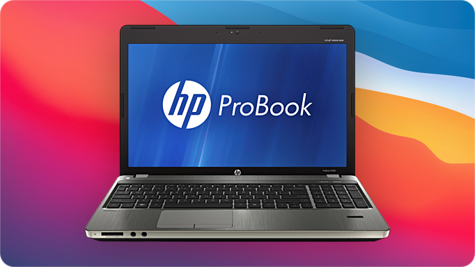

<p align="center"></p>
<h1 align="center">ProBook 4x30s OpenCore</h1>
<h3 align="center">4330s / 4530s / 4730s</h3>

Detailed instructions on how to install recent version of [macOS](https://en.wikipedia.org/wiki/MacOS) on HP ProBook 30s series laptops with second generation Sandy Bridge Intel Core i CPUs, – specifically, a [ProBook 4530s](https://support.hp.com/us-en/product/hp-probook-4530s-notebook-pc/5060880). This is also a long-overdue update to the previous guide posted here, now with proper ACPI patches, important corrections and recommendations.


> [!IMPORTANT]
> There is a [newer guide](https://github.com/ubihazard/probook-4x40s-oc "macOS for ProBook 4x40s") for 40s series laptops with third generation Intel Ivy Bridge CPUs and Metal-capable graphics now available with much better support for modern macOS. Some content was moved there to avoid duplication.

> [!NOTE]
> In the process certain adjustments for your particular laptop will need to be made because ProBooks shipped in many different configurations. Therefore it is highly recommended that you read the official OpenCore [install guide](https://dortania.github.io/OpenCore-Install-Guide/ "OpenCore install guide") first to get familiar with the process. This will make it much easier for you to follow instructions and adapt them for you needs.

Also note that only models with integrated Intel HD 3000 graphics are supported by this guide. Laptops with Radeon GPU require additional steps to [turn discrete GPU off](#disabling-dedicated-gpu) because it is not supported by macOS.

Despite effort was made to ensure all steps are as easy to follow and clear as possible, the process is not straightforward and a certain level of skill, experience with command line, patience, and ability to troubleshoot are a must. A complete OpenCore [EFI folder](https://github.com/ubihazard/probook-4x30s-oc/releases/latest "Download") is available for your reference.

Introduction
------------

ProBook 4530s is an old laptop from Sandy Bridge era made by HP. With a handful of [aftermarket upgrades](#upgrading-your-probook) it can still make a powerful machine for simple daily tasks. More importantly, even in stock condition it is fairly compatible with macOS. And this is what we are going to do – putting macOS on it by means of [OpenCore](https://github.com/acidanthera/OpenCorePkg) bootloader and a collection of [kernel extensions](#kernel-extensions) made by talented individuals from hackintosh community.

So this is the configuration[^1] we are going to work with:

| Item         | Description
| ------------ | -----------
| **CPU**      | Intel Core i7-2640M
| **GPU**      | Intel HD 3000
| **RAM**      | 16 GB DDR3
| **Storage**  | 512 GB SATA SSD
| **Ethernet** | Realtek RTL8111
| **Wireless** | Atheros AR9285
| **USB 3.0**  | NEC Renesas uPD720200
| **Card Reader** | JMicron JMB38X
| **Optical Drive** | HP DVD-RW AD-7740H
| **macOS**    | Monterey 12.7.6
| **OpenCore** | [1.0.6-0cc8c81](https://github.com/ubihazard/OpenCorePkg-ProBook-Legacy/releases/tag/v1.0.6-0cc8c81) for legacy ProBook
| **OCLP** | [2.4.1](https://github.com/dortania/OpenCore-Legacy-Patcher/releases/tag/2.4.1)

[^1]: Webcam works up to Mojave. USB 3.0 works up to Catalina. USB 2.0, Bluetooth and webcam need proper [USB port mapping](#fixing-usb).

Although this laptop is very old, macOS works surprisingly well on it with pretty much full compatibility. You can expect relatively smooth web browsing experience, word processing, and coding light projects in VS Code (nothing too demanding). Don‘t expect running XCode with iOS simulator on it though. It can also help you manage your iThings if you don‘t already have a Mac.

OpenCore for Legacy ProBook
---------------------------

This guide now uses a [custom build](https://github.com/ubihazard/OpenCorePkg-ProBook-Legacy/releases) of OpenCore put together by me specifically for use with legacy ProBook laptops. It includes two EFI modules for ProBook 4x30s.

  * `ProBookFanReset.efi` resets fan control from macOS back to automatic BIOS management. This needs to be done every time after using quiet fan patch to restore embedded controller state, and the best place to do it is during boot up.

  * `ProBookWifiUnblock.efi` is necessary if you plan to install a [non-whitelisted](#enabling-broadcom-wireless) (not approved by HP) Wi-Fi card in your ProBook 4x30s laptop. Thankfully, this module *is not needed* for 4x40s because in an unusual move by HP they did not cripple 40s series laptops with a BIOS Wi-Fi whitelist.

> [!IMPORTANT]
> **Do not use these EFI modules with any other laptop other than ProBook 30s or 40s series. Doing so can brick your device!**

Converting from Clover
----------------------

Note that Clover and OpenCore don’t mix well together. In my experience a NVRAM reset is required when switching from Clover to OpenCore, or the kernel might panic with weird error message during boot. If you’ve been using Clover before, make sure to perform a NVRAM reset on your first OpenCore boot. This can be done from OpenCore boot menu screen: press space to reveal the corresponding hidden menu entry.

Kernel Extensions
-----------------

Or “kexts” are equivalent of “drivers” in Windows and are required for proper hardware support by macOS. Most of the important kernel extensions, such as graphics, come preloaded with the operating system. But the nature of hackintosh requires additional kexts to be added for certain devices which aren’t natively supported by macOS because they aren’t found in actual Macs made by Apple, such as network cards, SD card readers, and trackpads in case of laptops.

All required kexts are already assembled in one place in the provided OpenCore [EFI folder](https://github.com/ubihazard/probook-4x30s-oc/releases/latest).

  * `Lilu.kext` [1.7.1]: Basic kext required for patching
  * `ECEnabler.kext` [1.0.2]: Laptop battery patches
  * `WhateverGreen.kext` [1.7.0]: Graphics patches
  * `VirtualSMC.kext` [1.3.7]: SMC emulation
      * `SMCProcessor.kext`: CPU support
      * `SMCSuperIO.kext`: EC support
      * `SMCBatteryManager.kext`: Laptop battery
      * `SMCLightSensor.kext`: Laptop lid light sensor
  * `VoodooPS2Controller.kext` [1.9.2]: PS/2 input support
      * `VoodooPS2Keyboard.kext`
      * `VoodooPS2Trackpad.kext`
  * `RealtekRTL8111.kext` [3.0.0]: Wired ethernet
  * `AppleALC.kext` [1.9.5]: Audio patches
  * `USBMap.kext`: USB port map
      * `USBInjectAll.kext` [0.8.1]: Initial setup and port mapping
  * `mXHCD.kext` [1.0.0]: Renesas USB 3.0
      * `GenericUSBXHCI.kext` [1.3.0b1]: Legacy USB 3.0
  * `IOath3kfrmwr.kext` [1.3]: Wireless
      * `IOath3kdevice.kext`
  * `HS80211Family.kext` [12.0]: Wireless
  * `AirPortAtheros40.kext` [7.0]: Wireless
      * `ProBookAtheros.kext` [1.0.3]
      * `WifiLocFix.kext`
  * `JMB38X.kext` [1.5.0]: SD card reader
      * `HSSDBlockStorage.kext`
  * `ASPP-Override.kext`: Legacy power management
  * `ACPIPoller.kext`: Laptop fan control
  * `NoTouchID.kext`: Disable Touch ID
  * `SimpleMSR.kext`: Fix BD PROCHOT due to lack of working battery

We will be enabling some and disabling others during the [post-install](#post-install) stage to adjust for your own laptop configuration.

Installation
------------

> [!IMPORTANT]
> Update your laptop BIOS to the latest version from HP support website. The included ACPI patches should work with any BIOS version but only the latest was actually tested.

Follow the official Dortania instructions to [make a bootable macOS USB installer](https://dortania.github.io/OpenCore-Install-Guide/installer-guide/). After creating USB installer mount its EFI partition and copy OpenCore files downloaded from [releases page](https://github.com/ubihazard/probook-4x30s-oc/releases/latest "Download") replacing `config.plist` with `config-usb.plist`. It‘s a configuration variant modified specifically for use with macOS installer that disables some kexts which are useless or can cause problems during setup process (Wi-Fi, Bluetooth, SD card reader, etc.), doesn’t modify SIP flags or mess with AMFI, enables verbose boot text messages so you can troubleshoot boot issues, and has a different SMBIOS Mac model which allows to install more recent macOS versions, which aren’t supported natively, but supported with the help of [OpenCore Legacy Patcher](https://github.com/dortania/OpenCore-Legacy-Patcher) (OCLP), – up to Monterey with the provided OpenCore configuration and Broadcom wireless card.

### HD+ and Full HD Screens

If you own a 4730s model ProBook with HD+ 1600x900 screen or replaced your 4530s stock LCD panel with a full HD one, an additional iGPU device parameter must be set to enable proper operation of your laptop screen. Add the following under `DeviceProperties/Add/PciRoot(0x0)/Pci(0x2,0x0)` section for both regular and USB version of `config.plist` before starting the setup process:

```xml
<key>AAPL00,DualLink</key>
<data>AQAAAA==</data>
```

### Resetting Power Management

Unless your ProBook already comes with a Core i7-2640M, like mine, you need to disable CPU power management for your very first setup. This step is required for legacy Intel CPUs used in Sandy Bridge and Ivy Bridge era ProBooks.

  * Open `config.plist` copied to EFI partition on a USB drive. Disable the `SSDT-PM.aml` ACPI table under `ACPI/Add`, set `Enabled` to `false`.

    <details>
    <summary><strong>Example</strong></summary><br>

    ```xml
    <dict>
        <key>Comment</key>
        <string>Core i7-2640M power management</string>
        <key>Enabled</key>
        <false/>
        <key>Path</key>
        <string>SSDT-PM.aml</string>
    </dict>
    ```
    </details>

  * Drop `CpuPm` and `Cpu0Ist` OEM CPU tables under `ACPI/Delete`, set `Enabled` to `true`.

    <details>
    <summary><strong>Example</strong></summary><br>

    ```xml
    <key>Delete</key>
    <array>
        <dict>
            <key>All</key>
            <false/>
            <key>Comment</key>
            <string>Delete CpuPm</string>
            <key>Enabled</key>
            <true/>
            <key>OemTableId</key>
            <data>Q3B1UG0AAAA=</data>
            <key>TableLength</key>
            <integer>0</integer>
            <key>TableSignature</key>
            <data>U1NEVA==</data>
        </dict>
        <dict>
            <key>All</key>
            <false/>
            <key>Comment</key>
            <string>Delete Cpu0Ist</string>
            <key>Enabled</key>
            <true/>
            <key>OemTableId</key>
            <data>Q3B1MElzdAA=</data>
            <key>TableLength</key>
            <integer>0</integer>
            <key>TableSignature</key>
            <data>U1NEVA==</data>
        </dict>
    </array>
    ```
    </details>

  * Enable `NullCPUPowerManagement.kext` under `Kernel/Add`, set `Enabled` to `true`.

    <details>
    <summary><strong>Example</strong></summary><br>

    ```xml
    <dict>
        <key>Arch</key>
        <string>Any</string>
        <key>BundlePath</key>
        <string>NullCPUPowerManagement.kext</string>
        <key>Comment</key>
        <string>NullCPUPowerManagement.kext</string>
        <key>Enabled</key>
        <true/>
        <key>ExecutablePath</key>
        <string>Contents/MacOS/NullCPUPowerManagement</string>
        <key>MaxKernel</key>
        <string></string>
        <key>MinKernel</key>
        <string></string>
        <key>PlistPath</key>
        <string>Contents/Info.plist</string>
    </dict>
    ```
    </details>

We will [re-enable](#restoring-power-management) proper CPU power management during a post-install step later.

### What macOS Version to Install

A few notes on what macOS to choose for installation. Typically, the recommended macOS version to install is Big Sur. It is modern enough for everyday use and has decent software support, including modern browser (Firefox is recommended for having much longer support of older macOS than Chrome).

Mojave and everything older is *not recommended* due to being way too outdated and having no decent modern browser support, making it difficult just to get on the Internet. Catalina and Mojave also aren‘t supported well by OCLP, which is required to restore legacy HD 3000 graphics acceleration.

However, if you managed to find and swapped in a compatible Broadcom Wi-Fi card, you can bump installed macOS version to Monterey. The caveat is that support for Bluetooth on these cards (any compatible card you can install in this laptop) on Monterey is sketchy at best: Airdrop, Handoff, and certain Continuity features might not work at all, would work but with issues, or only in one direction (from iPhone to ProBook, but not the other way around). Bluetooth input devices work fine though.

The minimum macOS version you can install using the provided OC EFI folder is High Sierra.

### Installing macOS Ventura

From Ventura onwards macOS requires a CPU with AVX2 instructions which all Sandy Bridge and Ivy Bridge CPUs lack. (AVX2 becomes available since Haswell.) Thus, Monterey is the final version of macOS you can *technically* install on this laptop.

Using [CryptexFixup](https://github.com/acidanthera/CryptexFixup) kext, which enables sort of AVX2 emulation, it is possible to install macOS Ventura (and even later macOS, all the way up to Sequoia). However, this isn‘t supported by this guide and is *not recommended*. macOS past Monterey increasingly relies high on Metal API in various places and bundled applications, and using non-metal GPU can be a real pain on such system. Also keep in mind that pretty much any third-party app designed to run on Ventura would expect AVX2 to be available and likely to experience random crashes due to lack thereof.

So this, in my opinion, remains an option only for maniacs willing to accomplish just this task of “successfully” running Ventura on an unsupported Sandy Bridge system, – for bragging rights.

If you are bold enough to go this route, you can refer to the [40s series guide](https://github.com/ubihazard/probook-4x40s-oc) for additional kexts and configuration changes, but don’t expect much success or pleasant experience.

### Running the Installer

Anyway, reboot your ProBook from the USB installer. During setup the machine will restart several times and if everything goes well you will end up on macOS welcome screen. To finish setup we need to copy OpenCore files to your system EFI partition (so you can boot without USB) and fix power management. This time, however, keep the `config.plist` from the provided OpenCore [EFI folder](https://github.com/ubihazard/probook-4x30s-oc/releases/latest "Download"), not `config-usb.plist`. The next step requires you to have working internet connection so hook your laptop up with an ethernet cable because Wi-Fi isn’t available yet.

> [!TIP]
> If, for some reason, you can’t have wired ethernet organized, skip through macOS initial setup prompts, [enable wireless kexts](#enabling-wi-fi-and-bluetooth) *in a `config.plist` on your USB EFI partition* and reboot from the USB stick again, – this time not into the installer but into the macOS you’ve just installed.

ACPI Patching
-------------

ACPI patches, like kexts, are required for basic functionality of your ProBook in macOS. Most ACPI patches for this laptop (and other ProBooks, EliteBooks, and ZBooks) were made by legendary [RehabMan](https://github.com/RehabMan/HP-ProBook-4x30s-DSDT-Patch) and then simply ported by me to work with OpenCore bootloader using his [patched DSDT](https://github.com/ubihazard/probook-4x40s-oc/ACPI/RehabMan/4x40s_IvyBridge.txt) and hot patch guide as sources. Other SSDTs are provided by Dortania in their [Sandy Bridge laptop guide](https://dortania.github.io/OpenCore-Install-Guide/config-laptop.plist/sandy-bridge.html "Sandy Bridge laptop guide").

These patches are compatible across all 30s series laptops regardless of configuration using latest BIOS from HP. What’s left is restoring proper CPU power management for the exact processor installed in your ProBook and ensuring correct USB port mapping. If your laptop comes with a discrete AMD GPU and you *don’t* want to turn it off in BIOS (to keep it available for other OSes), an [additional ACPI patch](#disabling-dedicated-gpu) is needed to turn it off exclusively in macOS.

### Restoring Power Management

Without proper CPU PM `AppleIntelCPUPowerManagement.kext` would cause kernel panic at boot so `NullCPUPowerManagement.kext` is used (in USB `config.plist`) to temporarily overtake control from it. Legacy CPU power management is enabled using the custom `SSDT-PM.aml` ACPI table. This table is specific to each CPU and has to be generated manually.

  * Follow the Dortania [guide](https://dortania.github.io/OpenCore-Post-Install/universal/pm.html#sandy-and-ivy-bridge-power-management) to create PM table for the CPU installed in your laptop.

  * Mount your EFI system partition (replace `X` and `Y` with your EFI disk identifiers) which is not on a USB:

    ```bash
    diskutil list
    sudo diskutil mount diskXsY
    ```

  * Copy the `ssdt.aml` generated by [ssdtPRGen.sh](https://github.com/Piker-Alpha/ssdtPRGen.sh) script to your EFI ACPI folder as `SSDT-PM.aml‌`:

    ```bash
    cp ~/Library/ssdtPRGen/ssdt.aml /Volumes/EFI/EFI/OC/ACPI/SSDT-PM.aml
    ```

    > Running `ssdtPRGen.sh` requires internet access. You can temporarily connect ethernet cable to your laptop.

  * Re-enable `SSDT-PM.aml` CPU PM table in `config.plist` under `ACPI/Add`, set `Enabled` to `true`.

    <details>
    <summary><strong>Example</strong></summary><br>

    ```xml
    <dict>
        <key>Comment</key>
        <string>SSDT-PM.aml</string>
        <key>Enabled</key>
        <true/>
        <key>Path</key>
        <string>SSDT-PM.aml</string>
    </dict>
    ```
    </details>

  * Restore OEM CPU tables you deleted earlier under `ACPI/Delete`, set `Enabled` to `false`.

    <details>
    <summary><strong>Example</strong></summary><br>

    ```xml
    <key>Delete</key>
    <array>
        <dict>
            <key>All</key>
            <false/>
            <key>Comment</key>
            <string>Delete CpuPm</string>
            <key>Enabled</key>
            <false/>
            <key>OemTableId</key>
            <data>Q3B1UG0AAAA=</data>
            <key>TableLength</key>
            <integer>0</integer>
            <key>TableSignature</key>
            <data>U1NEVA==</data>
        </dict>
        <dict>
            <key>All</key>
            <false/>
            <key>Comment</key>
            <string>Delete Cpu0Ist</string>
            <key>Enabled</key>
            <false/>
            <key>OemTableId</key>
            <data>Q3B1MElzdAA=</data>
            <key>TableLength</key>
            <integer>0</integer>
            <key>TableSignature</key>
            <data>U1NEVA==</data>
        </dict>
    </array>
    ```
    </details>

  * Disable `NullCPUPowerManagement.kext` under `Kernel/Add`, set `Enabled` to `false`.

    <details>
    <summary><strong>Example</strong></summary><br>

    ```xml
    <dict>
        <key>Arch</key>
        <string>Any</string>
        <key>BundlePath</key>
        <string>NullCPUPowerManagement.kext</string>
        <key>Comment</key>
        <string>NullCPUPowerManagement.kext</string>
        <key>Enabled</key>
        <false/>
        <key>ExecutablePath</key>
        <string>Contents/MacOS/NullCPUPowerManagement</string>
        <key>MaxKernel</key>
        <string></string>
        <key>MinKernel</key>
        <string></string>
        <key>PlistPath</key>
        <string>Contents/Info.plist</string>
    </dict>
    ```
    </details>

  * If you’ve installed Monterey make sure `ASPP-Override.kext` is enabled too. It is required to restore legacy CPU power management support which was at some point removed in Monterey:

    <details>
    <summary><strong>Example</strong></summary><br>

    ```xml
    <dict>
        <key>Arch</key>
        <string>Any</string>
        <key>BundlePath</key>
        <string>ASPP-Override.kext</string>
        <key>Comment</key>
        <string>ASPP-Override.kext</string>
        <key>Enabled</key>
        <true/>
        <key>ExecutablePath</key>
        <string></string>
        <key>MaxKernel</key>
        <string></string>
        <key>MinKernel</key>
        <string>21.4.0</string>
        <key>PlistPath</key>
        <string>Contents/Info.plist</string>
    </dict>
    ```
    </details>

### Disabling Dedicated GPU

For laptop configurations with dedicated GPU soldered onto motherboard an additional step of disabling (or “turning off”) of this unsupported GPU is needed. Unfortunately, I did not have a 30s series laptop with dGPU on hand, so I can’t provide direct instructions for ProBook 4530s exactly. I did, however, have an Ivy Bridge 4540s with Radeon dGPU, and because it is very similar with 4x30s in terms of ACPI configuration, you can grab my [dGPU off patch](https://github.com/ubihazard/probook-4x40s-oc#disabling-radeon) for 4540s and adapt it for 4530s quite easily.

Alternatively, `-wegnoegpu` [WhateverGreen boot argument](https://github.com/acidanthera/WhateverGreen "WhateverGreen configuration") can be used temporarily in `config.plist` while you are working on a real patch:

```xml
<key>boot-args</key>
<string>... -wegnoegpu</string>
```

Notice that this is *not* a proper patch because it does not actually turn the discrete GPU off so it doesn’t consume power, – it merely hides it from macOS so it doesn’t cause conflict and boot issues. And power consumption is very important, especially in a laptop. A GPU without drivers loaded for it will run with no power saving features enabled and will consume lots of power and overheat for no reason.

Or simply disable dGPU in your laptop‘s BIOS, – although in this case it would obviously be no longer available in other operating systems too, not just macOS. On the other hand, this approach is definitely the easiest.

### Fixing USB

The USB port map kext in this repo is for ProBook 4530s models with USB 3.0 port. If you have a different mainboard (such as with all USB 2.0 ports only) or if port mapping doesn‘t match for some other reason, you would have to re-map your USB ports by means of creating your own version of `USBMap.kext`, while still booted from the USB stick. This procedure is fully covered in Dortania [guide](https://dortania.github.io/OpenCore-Post-Install/usb/ "USB port mapping guide") and I won‘t be duplicating it here. In short, use [USBMap](https://github.com/corpnewt/USBMap "USBMap tool by corpnewt").

Post-install
------------

We still got stuff to do to make the system fully usable. Unless you decided to install very old macOS version for some reason, e.g. High Sierra, you’d be stuck without hardware graphics acceleration and, as a result, very slow and unusable user interface. This and other things, like Wi-Fi and Bluetooth, is fixed here.

### Quick Note on APFS

OpenCore from the provided EFI folder will load any APFS driver available. This is done to make initial setup easier in case of multiple macOS installations (e.g. High Sierra together with Big Sur). For security reasons, it is recommeded that after installation you would [change](https://dortania.github.io/OpenCore-Install-Guide/config-laptop.plist/sandy-bridge.html#apfs) the minimum allowed APFS driver version according to the latest macOS version you have installed. For Big Sur and above leave both `MinVersion` and `MinDate` at `0`.

### Disabling SIP and AMFI

Due to extensive modifications required to support this laptop on modern macOS it is required to disable SIP in `NVRAM/Add/7C436110-AB2A-4BBB-A880-FE41995C9F82` (the configured value is `0x803`):

```xml
<key>csr-active-config</key>
<data>AwgAAA==</data>
```

AMFI is disabled via `boot-args`:

```xml
<key>boot-args</key>
<string>... amfi=0x80 amfi_get_out_of_my_way=1</string>
```

These modifications are already done in the provided `config.plist`, I’m just making it obvious here. The `amfi_get_out_of_my_way=1` parameter appears to be redundant. However, if a tool like [OCLP](#restoring-graphics-acceleration) complains about AMFI not being disabled, feel free to add it back.

### Disabling Hibernation

Hibernation (deep sleep) isn’t available on hackintosh systems and must be explicitly turned off:

```bash
sudo pmset -a hibernatemode 0
```

We also remove the sleep image, which preserves RAM contents during sleep, and replace it with an empty folder to prevent it from being recreated (saving a couple of GB of disk space in the process):

```bash
sudo rm /var/vm/sleepimage
sudo mkdir /var/vm/sleepimage
```

### Enabling TRIM

macOS does not automatically enable TRIM for non-Apple SSDs, even if it is installed on such. Using an SSD without TRIM will result in suboptimal performance and reduce its lifespan. We must force enable TRIM with the following command:

```bash
sudo trimforce enable
```

Ignore the warning message and proceed anyway. There are no known SATA SSD drives that have issues with macOS and TRIM support.

### Restoring Graphics Acceleration

One of the first [post-install](https://dortania.github.io/OpenCore-Post-Install/ "Post-install OpenCore guide") tasks you will have to perform, unless you decided to stick with High Sierra, is restoring graphics acceleration along with native desktop resolution.

Intel HD 3000 doesn‘t support Metal graphics acceleration API available in macOS since El Capitan. And since Mojave HD 3000 itself isn‘t supported at all: you will need to use [OpenCore Legacy Patcher](https://github.com/dortania/OpenCore-Legacy-Patcher "OCLP") to install patched kexts and frameworks that restore graphics acceleration and work-around lack of Metal requirement.

Reboot without USB installer: this is important because USB config doesn’t use proper SMBIOS model and doesn’t disable SIP and AMFI required for patcher to work. Download OCLP and allow it to install root patches. Reboot one more time and you should be greeted by a proper desktop in glorious native resolution.

Note that patcher only enables macOS graphical interface to function properly (mostly). Applications, such as iWork suite or Microsoft Office, that *do* use Metal cannot be worked around but can be replaced with their older non-Metal versions. Usually they work on Big Sur and Monterey just fine.

There’s additional information about [Intel HD 3000 graphics](#hd-3000-issues) that you need to be aware of.

### Fixing Blur Effects in Big Sur and Monterey

In Big Sur transparent effects, such as blur, render incorrectly on non-Metal GPUs (HD 3000 is not capable of Metal API). After installing [patched graphics kexts and frameworks](#restoring-graphics-acceleration) with OCLP it becomes possible to fall back to legacy blur drawing method:

```bash
defaults write -g Moraea_BlurBeta -bool true
```

You might also experiment with different blur strength, style of dark window borders, and dark menu bar text:

```bash
defaults write -g ASB_BlurOverride -float 30
defaults write -g Moraea_RimBeta -bool true
defaults write -g Moraea_DarkMenuBar -bool true
```

In Monterey you can get noticeable performance improvement by enabling reduced transparency mode in Accessibility settings. (This mode is broken on Big Sur with patched kexts, unfortunately, rendering the menu bar unusable.) With this on, you can now selectively re-enable transparency and blur only for the Dock:

```bash
defaults write com.apple.dock Moraea_EnableTransparency 1
```

Log out and back in to apply the changes. Some of these [commands](https://moraea.github.io/Docs/defaults.html), like `Moraea_EnableTransparency`, require a reboot to be applied.

### Enabling Wi-Fi and Bluetooth

By default Atheros wireless is already configured in `config.plist`. You can verify that the following kexts are enabled in `config.plist`:

  * `IOath3kfrmwr.kext`,
  * `Legacy/IOath3kfrmwr.kext`,
  * `IOath3kdevice.kext`,
  * `HS80211Family.kext`,
  * `AirPortAtheros40.kext`,
  * `ProBookAtheros.kext`
  * `WifiLocFix.kext`.

<details>
<summary><strong>Atheros wireless config</strong></summary><br>

```xml
<dict>
    <key>Arch</key>
    <string>Any</string>
    <key>BundlePath</key>
    <string>IOath3kfrmwr.kext</string>
    <key>Comment</key>
    <string>IOath3kfrmwr.kext</string>
    <key>Enabled</key>
    <true/>
    <key>ExecutablePath</key>
    <string>Contents/MacOS/IOath3kfrmwr</string>
    <key>MaxKernel</key>
    <string></string>
    <key>MinKernel</key>
    <string>18.0.0</string>
    <key>PlistPath</key>
    <string>Contents/Info.plist</string>
</dict>
<dict>
    <key>Arch</key>
    <string>Any</string>
    <key>BundlePath</key>
    <string>Legacy/IOath3kfrmwr.kext</string>
    <key>Comment</key>
    <string>IOath3kfrmwr.kext</string>
    <key>Enabled</key>
    <true/>
    <key>ExecutablePath</key>
    <string>Contents/MacOS/IOath3kfrmwr</string>
    <key>MaxKernel</key>
    <string>17.9.9</string>
    <key>MinKernel</key>
    <string></string>
    <key>PlistPath</key>
    <string>Contents/Info.plist</string>
</dict>
<dict>
    <key>Arch</key>
    <string>Any</string>
    <key>BundlePath</key>
    <string>IOath3kdevice.kext</string>
    <key>Comment</key>
    <string>IOath3kdevice.kext</string>
    <key>Enabled</key>
    <true/>
    <key>ExecutablePath</key>
    <string>Contents/MacOS/IOath3kdevice</string>
    <key>MaxKernel</key>
    <string>20.9.9</string>
    <key>MinKernel</key>
    <string>18.0.0</string>
    <key>PlistPath</key>
    <string>Contents/Info.plist</string>
</dict>
<dict>
    <key>Arch</key>
    <string>Any</string>
    <key>BundlePath</key>
    <string>HS80211Family.kext</string>
    <key>Comment</key>
    <string>HS80211Family.kext</string>
    <key>Enabled</key>
    <true/>
    <key>ExecutablePath</key>
    <string>Contents/MacOS/HS80211Family</string>
    <key>MaxKernel</key>
    <string>20.9.9</string>
    <key>MinKernel</key>
    <string>18.0.0</string>
    <key>PlistPath</key>
    <string>Contents/Info.plist</string>
</dict>
<dict>
    <key>Arch</key>
    <string>Any</string>
    <key>BundlePath</key>
    <string>AirPortAtheros40.kext</string>
    <key>Comment</key>
    <string>AirPortAtheros40.kext</string>
    <key>Enabled</key>
    <true/>
    <key>ExecutablePath</key>
    <string>Contents/MacOS/AirPortAtheros40</string>
    <key>MaxKernel</key>
    <string>20.9.9</string>
    <key>MinKernel</key>
    <string>18.0.0</string>
    <key>PlistPath</key>
    <string>Contents/Info.plist</string>
</dict>
<dict>
    <key>Arch</key>
    <string>Any</string>
    <key>BundlePath</key>
    <string>ProBookAtheros.kext</string>
    <key>Comment</key>
    <string>ProBookAtheros.kext</string>
    <key>Enabled</key>
    <true/>
    <key>ExecutablePath</key>
    <string></string>
    <key>MaxKernel</key>
    <string>17.9.9</string>
    <key>MinKernel</key>
    <string></string>
    <key>PlistPath</key>
    <string>Contents/Info.plist</string>
</dict>
<dict>
    <key>Arch</key>
    <string>Any</string>
    <key>BundlePath</key>
    <string>WifiLocFix.kext</string>
    <key>Comment</key>
    <string>WifiLocFix.kext</string>
    <key>Enabled</key>
    <true/>
    <key>ExecutablePath</key>
    <string></string>
    <key>MaxKernel</key>
    <string></string>
    <key>MinKernel</key>
    <string></string>
    <key>PlistPath</key>
    <string>Contents/Info.plist</string>
</dict>
```
</details>

Optional: open `WifiLocFix.kext/Contents/Info.plist` in a plain text editor and change the `US` country code and locale (`FCC` for USA or `ETSI` for Europe):

```xml
<dict>
    <key>IO80211CountryCode</key>
    <string>US</string>
    <key>IO80211Locale</key>
    <string>FCC</string>
</dict>
```

If you opted to install Broadcom card in your ProBook, head over to the [dedicated section](#enabling-broadcom-wireless) for your wireless configuration. Otherwise, make sure to remove Broadcom kexts from your `config.plist` if they are present.

### Enabling SD Card Reader

The official [installer](https://github.com/chris1111/JMicron-Card-Reader) for JMicron PCI SD card reader package recommends installing kexts to `/Library/Extensions`. Although no adverse effects were found in injecting them from bootloader, we will follow the official recommendation.

  * Mount your SSD EFI folder.
    ```bash
    diskutil list
    sudo diskutil mount diskXsY
    ```
  * If using Mojave or Catalina:
      * Copy legacy kexts from EFI folder.
        ```bash
        sudo cp -r /EFI/EFI/OC/Kexts/Legacy/JMB38X.kext /Library/Extensions
        sudo cp -r /EFI/EFI/OC/Kexts/Legacy/HSSDBlockStorage.kext /Library/Extensions
        ```
      * Rebuild kernel cache.
        ```bash
        sudo kextcache -i /
        ```
  * If using Big Sur and above:
      * Copy modern kexts.
        ```bash
        sudo cp -r /EFI/EFI/OC/Kexts/JMB38X.kext /Library/Extensions
        sudo cp -r /EFI/EFI/OC/Kexts/HSSDBlockStorage.kext /Library/Extensions
        ```
      * Approve new kexts in System Preferences when prompted.

Reboot to use the card reader.

The kext description makes it seem like it works only up to Ventura but it actually functions just fine on Sonoma and Sequoia.

### Configuring Trackpad

Since your laptop battery is probably long dead, macOS would not recognize it. And without a recognized battery modern versions of macOS also prevent changing trackpad settings (go figure).

In reality the trackpad is fully working, – you just can’t access its settings. In order to configure it you would have to manually edit the binary `.plist` file at `~/Library/Preferences/com.apple.AppleMultitouchTrackpad.plist`.

Copy it to your desktop and convert it from binary format to XML:

```bash
cd ~/Dekstop
cp ~/Library/Preferences/com.apple.AppleMultitouchTrackpad.plist ./
plutil -convert xml1 com.apple.AppleMultitouchTrackpad.plist
```

Make your edits (make sure the syntax is correct) and convert the XML config back into binary format:

```bash
nano com.apple.AppleMultitouchTrackpad.plist
plutil -convert binary1 com.apple.AppleMultitouchTrackpad.plist
```

Replace the original file with your edited copy:

```bash
cp com.apple.AppleMultitouchTrackpad.plist ~/Library/Preferences/
```

Finally, increase the tracking speed (default value is `0.6875`):

```bash
defaults write -g com.apple.trackpad.scaling -float 1.0
```

*Rebooting is required to apply these changes.* Assuming you also didn‘t make any mistakes while editing the file.

A pre-made trackpad configuration file with tap to click is [provided](/Library/Preferences/com.apple.AppleMultitouchTrackpad.plist "Trackpad config") and should suit most users well. Copy it to `~/Library/Preferences` replacing the original, if you can’t bother editing your own.

### Function Keys

By default function keys on your laptop are going to work as F1..F12 and in order to obtain special function, such as brightness or volume control, a special Fn key must be pressed. For Apple keyboards the setting to toggle this behavior can be found in (suprise) keyboard preferences. But since ProBook keyboard is completely different the relevant setting would not be available. In our case a special `SSDT-KBFN.aml` SSDT is needed to alter the default behavior.

Like other SSDTs, it needs to be activated in `config.plist`:

```xml
<dict>
    <key>Comment</key>
    <string>Function keys fix</string>
    <key>Enabled</key>
    <true/>
    <key>Path</key>
    <string>SSDT-KBFN.aml</string>
</dict>
```

### Filling Your System Information

The final step to setting up your new hackintosh laptop is generating unique serial number and system UUID. You can skip this step if you don‘t plan to use App Store or connect with Apple, otherwise it is required to make iCloud or iMessage work.

> [!IMPORTANT]
> If you don‘t own any real Apple product, such as an iPhone or iPad, registering with iServices through a hackintosh system would likely trigger a security check instantly, putting your new account on hold. In this case it is recommended to keep iCloud and iMessage disabled and limit your online Apple interactions to App Store only.

First, you need to choose the Mac SMBIOS product name that resembles your hardware most closely. For this laptop model it would be `MacBookPro8,1`. If you opted to upgrade your ProBook with quad-core CPU (against [my advice](#processor)), `MacBookPro8,2` would be a preferred choice, – but see a note below for USB port mapping adjustment. Now you can use `macserial` tool from OpenCore utilities to generate serials (`SystemSerialNumber` and `MLB`, or motherboard serial number):

```bash
./macserial -m 'MacBookPro8,1' -n 1
```

The system serial number you generated must be reported as “invalid” or “not found” on Apple [support coverage](https://checkcoverage.apple.com/ "Serial number check") page. If it comes back as “valid”, it means `macserial` somehow generated a number that belongs to an actual produced Mac, and you must generate another pair of serials.

Next, find out your ethernet adapter MAC address and strip it of `:` characters, – this would be your `ROM` (it is better to pick wired interface MAC address rather than wireless):

```bash
ifconfig
```

Encode your `ROM` value in Base64:

```bash
echo AABBCCXXYYZZ | xxd -ps -r | base64
```

Finally, generate the `SystemUUID` for your ProBook:

```bash
uuidgen
```

Now we can fill this information under `PlatformInfo/Generic`:

<details>
<summary><strong>Example</strong></summary><br>

```xml
<key>Generic</key>
<dict>
    <key>AdviseFeatures</key>
    <false/>
    <key>MLB</key>
    <string>M0000000000000001</string>
    <key>MaxBIOSVersion</key>
    <false/>
    <key>ProcessorType</key>
    <integer>0</integer>
    <key>ROM</key>
    <data>ABCDEF==</data>
    <key>SpoofVendor</key>
    <true/>
    <key>SystemMemoryStatus</key>
    <string>Auto</string>
    <key>SystemProductName</key>
    <string>MacBookPro8,1</string>
    <key>SystemSerialNumber</key>
    <string>W00000000001</string>
    <key>SystemUUID</key>
    <string>XXXXXXXX-XXXX-XXXX-XXXX-XXXXXXXXXXXX</string>
</dict>
```
</details>

### USB Port Mapping and SMBIOS

> [!IMPORTANT]
> If you change your SMBIOS name for whatever reason `USBMap.kext` must be adjusted because it depends on it. Open `USBMap.kext/Contents/Info.plist` in a plain text editor and replace all instances of `MacBookPro8,1` with SMBIOS name of your choice. (There’s an additional `USBMap.kext` in `Legacy` subfolder for older macOS.)

### Windows Dual-boot Issues

OpenCore does quite a good job pretending you are using a real Mac. This is obviously good for macOS but can present problems if you boot other operating systems through OC. Because your system is literally masquerading as a MacBook Pro, Windows will attempt to install drivers belonging to an actual Mac Book, which is definitely not what we want. Official driver packages from HP would likely fail to install for the same reason.

To fix this we need to make couple adjustments. Set `CustomSMBIOSGuid` to `true` under `Kernel/Quirks`:

```xml
<key>CustomSMBIOSGuid</key>
<true/>
```

Change `UpdateSMBIOSMode` from `Create` to `Custom` in `PlatformInfo`:

```xml
<key>UpdateSMBIOSMode</key>
<string>Custom</string>
```

### Firefox Not Starting on Monterey

Add `ipc_control_port_options=0` to `boot-args` config section:

```xml
<key>boot-args</key>
<string>-no_compat_check amfi_get_out_of_my_way=1 amfi=0x80 ipc_control_port_options=0</string>
```

### Quiet Fan Patch

The default HP BIOS fan curve for ProBook is configured to increase fan speed way too early, causing laptop fan to constantly spin up and down at slightest load, which is quite annoying. Fortunately, an intelligent fan control was developed by RehabMan based on ACPI hack approach used by similar projects on other OSes for SMSC KBC-1126 Super I/O chip employed in ProBooks. It consists of a support kext and ACPI code which injects custom fan curve for much better fan behavior.

Enable the `ACPIPoller.kext`:

<details>
<summary><strong>Example</strong></summary><br>

```xml
<dict>
    <key>Arch</key>
    <string>Any</string>
    <key>BundlePath</key>
    <string>ACPIPoller.kext</string>
    <key>Comment</key>
    <string>Needed for quiet fan patch</string>
    <key>Enabled</key>
    <true/>
    <key>ExecutablePath</key>
    <string>Contents/MacOS/ACPIPoller</string>
    <key>MaxKernel</key>
    <string></string>
    <key>MinKernel</key>
    <string></string>
    <key>PlistPath</key>
    <string>Contents/Info.plist</string>
</dict>
```
</details>

Apply the custom fan curve with `SSDT-FANUBI.aml`:

```xml
<dict>
    <key>Comment</key>
    <string>Quiet fan patch (needs ACPIPoller.kext)</string>
    <key>Enabled</key>
    <true/>
    <key>Path</key>
    <string>SSDT-FANUBI.aml</string>
</dict>
```

There are several fan behaviors available for choice:

  * `SSDT-FANREAD.aml`: Readings only, useless because there is no monitoring software which supports it.
  * `SSDT-FANORIG.aml`: Copy the default behavior.
  * `SSDT-FANQ.aml`: Original quiet fan patch by RehabMan.
  * `SSDT-FANRM.aml`: Alternative version by RehabMan.
  * `SSDT-FANGRAP.aml`: Yet another version by Don Grappler.
  * `SSDT-FANUBI.aml`: An even more refined version from me 😎

### Enhancing OpenCore Boot Picker

By default OpenCore uses textual or “console-like” interface for the boot picker, which is seen on a USB variant of configuration in `config-usb.plist`. Although sufficient for installation, some [GUI](https://dortania.github.io/OpenCore-Post-Install/cosmetic/gui.html "Pimp my OpenCore") would be nice to have on an actual finished install. The graphical user interface is enabled with `OpenCanopy.efi` OpenCore addon:

```xml
<dict>
    <key>Arguments</key>
    <string></string>
    <key>Comment</key>
    <string>OpenCanopy.efi</string>
    <key>Enabled</key>
    <true/>
    <key>LoadEarly</key>
    <false/>
    <key>Path</key>
    <string>OpenCanopy.efi</string>
</dict>
```

Enable custom boot picker under `Misc/Boot`:

```xml
<key>PickerMode</key>
<string>External</string>
<key>PickerVariant</key>
<string>Acidanthera\Syrah</string>
<key>PickerAttributes</key>
<integer>3</integer>
```

We can even add a [boot chime](https://dortania.github.io/OpenCore-Post-Install/cosmetic/gui.html#setting-up-boot-chime-with-audiodxe):

```xml
<dict>
    <key>Arguments</key>
    <string></string>
    <key>Comment</key>
    <string>AudioDxe.efi</string>
    <key>Enabled</key>
    <true/>
    <key>LoadEarly</key>
    <false/>
    <key>Path</key>
    <string>AudioDxe.efi</string>
</dict>
```

Configure it in `UEFI/Audio`:

<details>
<summary><strong>Example</strong></summary><br>

```xml
<key>Audio</key>
<dict>
    <key>AudioCodec</key>
    <integer>0</integer>
    <key>AudioDevice</key>
    <string>PciRoot(0x0)/Pci(0x1b,0x0)</string>
    <key>AudioOutMask</key>
    <integer>-1</integer>
    <key>AudioSupport</key>
    <true/>
    <key>DisconnectHda</key>
    <false/>
    <key>MaximumGain</key>
    <integer>-15</integer>
    <key>MinimumAssistGain</key>
    <integer>-30</integer>
    <key>MinimumAudibleGain</key>
    <integer>-55</integer>
    <key>PlayChime</key>
    <string>Enabled</string>
    <key>ResetTrafficClass</key>
    <false/>
    <key>SetupDelay</key>
    <integer>500</integer>
</dict>
```
</details>

Notice `PciRoot(0x0)/Pci(0x1b,0x0)` ACPI path which points to the sound card device. It can be easily discovered via `gfxutil -f HDEF`.

OpenCore does not come with graphical or audio resources out of the box. They must be obtained from [OcBinaryData](https://github.com/acidanthera/OcBinaryData/tree/master/Resources) package and extracted to `EFI/OC/Resources`. This is already done in the provided EFI folder.

### Custom Drive Icon and Label

After enabling graphical boot picker we can go one step further and add a better icon for the newly installed macOS. The location from where OpenCore picker reads custom boot entry icons is not obvious though.

  * Grab the [custom drive icon](https://github.com/ubihazard/probook-4x30s-oc/releases/latest) files from assets.

  * For Catalina and Mojave: mount the Preboot volume. Use `diskutil list` to find out the correct disk identifier and mount it manually. In this case the volume would be mounted under `/Volumes`. Starting with Big Sur Preboot volume is mounted automatically under `/System/Volumes`.

  * Choose the appropriate drive icon and copy it.

    ```bash
    sudo cp Drive\ Icon/Monterey.icns /System/Volumes/Preboot/<UUID>/.VolumeIcon.icns
    ```

    The `UUID` part refers to the specific macOS installation volume on APFS drive. Because there can be multiple installations on the same drive, make sure to figure out which UUID belongs where.

  * Optional for Big Sur and later: copy your custom icon to Data volume root as well. This will change drive appearance in Disk Utility and Finder in macOS itself.

    ```bash
    sudo cp Drive\ Icon/Monterey.icns /System/Volumes/Data/.VolumeIcon.icns
    ```

  * If you ever end up renaming your macOS volume you might need to update its label because it is stored in both textual and graphical form. Make a new graphical label using `disklabel` OpenCore utility:

    ```bash
    disklabel -e 'macOS Monterey' .disk_label .disk_label_2x
    ```

  * Copy new labels:

    ```bash
    sudo cp .disk_label /System/Volumes/Preboot/<UUID>/System/Library/CoreServices/.disk_label
    sudo cp .disk_label_2x /System/Volumes/Preboot/<UUID>/System/Library/CoreServices/.disk_label_2x
    ```

  * Replace `.disk_label.contentDetails` text file with new contents to match the created graphical labels:

    ```bash
    printf 'macOS Monterey' > .disk_label.contentDetails
    sudo cp .disk_label.contentDetails /System/Volumes/Preboot/<UUID>/System/Library/CoreServices/.disk_label.contentDetails
    ```

Next time you reboot the macOS boot entry will change to a new icon and label.

Enabling Broadcom Wireless
--------------------------

As already [mentioned](#opencore-for-legacy-probook), ProBook 4530s suffers from a dreaded Wi-Fi BIOS whitelist preventing you from changing wireless adapter to a better supported Broadcom card. Fortunately, there’s a two-step solution to this problem. First, a simple hardware mod must be performed on a card.

### Hardware Mod

You will need to mask certain PCB contacts with tiny pieces of kapton tape to prevent HP firmware from turning the Wi-Fi module off. Without this mod only Bluetooth side will work.


> [!NOTE]
> This guide assumes you are using Broadcom BCM94352HMB, which is the best wireless module you can put in your ProBook laptop. If you’ve got another compatible Broadcom adapter the pin out might be different. In that case you need to consult the datasheet for your card and determine where equivalent contacts are located.

### Defeating 30s Series Wi-Fi Whitelist

Next, enable BIOS Wi-Fi whitelist bypass EFI driver in `UEFI/Drivers`:

<details>
<summary><strong>Example</strong></summary><br>

```xml
<dict>
    <key>Arguments</key>
    <string></string>
    <key>Comment</key>
    <string>ProBookWifiWhlistOff.efi</string>
    <key>Enabled</key>
    <true/>
    <key>LoadEarly</key>
    <false/>
    <key>Path</key>
    <string>ProBookWifiUnblock.efi</string>
</dict>
```
</details>

> [!IMPORTANT]
> **Do not use this module with any other laptop other than ProBook 30s series: doing so can brick your device!**

The laptop firmware will still warn you about incompatible wireless card installed, but it would no longer be actually disabled, despite what the warning message says (just skip it with <kbd>Enter</kbd>).

### Broadcom Configuration

Remove Atheros wireless kexts entries from `config.plist`:

  * `IOath3kfrmwr.kext`,
  * `Legacy/IOath3kfrmwr.kext`,
  * `IOath3kdevice.kext`,
  * `HS80211Family.kext`,
  * `AirPortAtheros40.kext`,
  * `ProBookAtheros.kext`,
  * `WifiLocFix.kext`.

Download Broadcom wireless kexts from [4x40s EFI folder](https://github.com/ubihazard/probook-4x40s-oc/releases/latest "40s series OC EFI") and copy them to `EFI/OC/Kexts` on your system EFI partition:

  * `AirportBrcmFixup.kext` (includes plugins):
      * `AirPortBrcmNIC_Injector.kext`,
      * `AirPortBrcm4360_Injector.kext`,
  * `IOSkywalkFamily.kext`,
  * `IO80211FamilyLegacy.kext` (with plugin),
      * `IO80211FamilyLegacy.kext/Contents/PlugIns/AirPortBrcmNIC.kext`,
  * `BlueToolFixup.kext`,
  * `BrcmBluetoothInjector.kext`,
  * `BrcmFirmwareData.kext`
  * `BrcmPatchRAM3.kext`.

Finally, copy and paste the following section where Atheros configuration was previously (order of kexts matters):

<details>
<summary><strong>Broadcom wireless config</strong></summary><br>

```xml
<dict>
    <key>Arch</key>
    <string>Any</string>
    <key>BundlePath</key>
    <string>BrcmFirmwareData.kext</string>
    <key>Comment</key>
    <string>BrcmFirmwareData.kext</string>
    <key>Enabled</key>
    <true/>
    <key>ExecutablePath</key>
    <string>Contents/MacOS/BrcmFirmwareData</string>
    <key>MaxKernel</key>
    <string></string>
    <key>MinKernel</key>
    <string>19.0.0</string>
    <key>PlistPath</key>
    <string>Contents/Info.plist</string>
</dict>
<dict>
    <key>Arch</key>
    <string>Any</string>
    <key>BundlePath</key>
    <string>BrcmFirmwareRepo.kext</string>
    <key>Comment</key>
    <string>Must be installed manually to /Library/Extensions</string>
    <key>Enabled</key>
    <false/>
    <key>ExecutablePath</key>
    <string>Contents/MacOS/BrcmFirmwareRepo</string>
    <key>MaxKernel</key>
    <string>18.9.9</string>
    <key>MinKernel</key>
    <string></string>
    <key>PlistPath</key>
    <string>Contents/Info.plist</string>
</dict>
<dict>
    <key>Arch</key>
    <string>Any</string>
    <key>BundlePath</key>
    <string>BlueToolFixup.kext</string>
    <key>Comment</key>
    <string>BlueToolFixup.kext</string>
    <key>Enabled</key>
    <true/>
    <key>ExecutablePath</key>
    <string>Contents/MacOS/BlueToolFixup</string>
    <key>MaxKernel</key>
    <string></string>
    <key>MinKernel</key>
    <string>21.0.0</string>
    <key>PlistPath</key>
    <string>Contents/Info.plist</string>
</dict>
<dict>
    <key>Arch</key>
    <string>Any</string>
    <key>BundlePath</key>
    <string>BrcmBluetoothInjector.kext</string>
    <key>Comment</key>
    <string>BrcmBluetoothInjector.kext</string>
    <key>Enabled</key>
    <true/>
    <key>ExecutablePath</key>
    <string></string>
    <key>MaxKernel</key>
    <string>20.9.9</string>
    <key>MinKernel</key>
    <string>18.0.0</string>
    <key>PlistPath</key>
    <string>Contents/Info.plist</string>
</dict>
<dict>
    <key>Arch</key>
    <string>Any</string>
    <key>BundlePath</key>
    <string>BrcmPatchRAM3.kext</string>
    <key>Comment</key>
    <string>BrcmPatchRAM3.kext</string>
    <key>Enabled</key>
    <true/>
    <key>ExecutablePath</key>
    <string>Contents/MacOS/BrcmPatchRAM3</string>
    <key>MaxKernel</key>
    <string></string>
    <key>MinKernel</key>
    <string>19.0.0</string>
    <key>PlistPath</key>
    <string>Contents/Info.plist</string>
</dict>
<dict>
    <key>Arch</key>
    <string>Any</string>
    <key>BundlePath</key>
    <string>BrcmPatchRAM2.kext</string>
    <key>Comment</key>
    <string>Must be installed manually to /Library/Extensions</string>
    <key>Enabled</key>
    <false/>
    <key>ExecutablePath</key>
    <string>Contents/MacOS/BrcmPatchRAM2</string>
    <key>MaxKernel</key>
    <string>18.9.9</string>
    <key>MinKernel</key>
    <string>15.0.0</string>
    <key>PlistPath</key>
    <string>Contents/Info.plist</string>
</dict>
<dict>
    <key>Arch</key>
    <string>Any</string>
    <key>BundlePath</key>
    <string>IOSkywalkFamily.kext</string>
    <key>Comment</key>
    <string>IOSkywalkFamily.kext</string>
    <key>Enabled</key>
    <true/>
    <key>ExecutablePath</key>
    <string>Contents/MacOS/IOSkywalkFamily</string>
    <key>MaxKernel</key>
    <string></string>
    <key>MinKernel</key>
    <string>23.0.0</string>
    <key>PlistPath</key>
    <string>Contents/Info.plist</string>
</dict>
<dict>
    <key>Arch</key>
    <string>Any</string>
    <key>BundlePath</key>
    <string>IO80211FamilyLegacy.kext</string>
    <key>Comment</key>
    <string>IO80211FamilyLegacy.kext</string>
    <key>Enabled</key>
    <true/>
    <key>ExecutablePath</key>
    <string>Contents/MacOS/IO80211FamilyLegacy</string>
    <key>MaxKernel</key>
    <string></string>
    <key>MinKernel</key>
    <string>23.0.0</string>
    <key>PlistPath</key>
    <string>Contents/Info.plist</string>
</dict>
<dict>
    <key>Arch</key>
    <string>Any</string>
    <key>BundlePath</key>
    <string>IO80211FamilyLegacy.kext/Contents/PlugIns/AirPortBrcmNIC.kext</string>
    <key>Comment</key>
    <string>IO80211FamilyLegacy.kext/Contents/PlugIns/AirPortBrcmNIC.kext</string>
    <key>Enabled</key>
    <true/>
    <key>ExecutablePath</key>
    <string>Contents/MacOS/AirPortBrcmNIC</string>
    <key>MaxKernel</key>
    <string></string>
    <key>MinKernel</key>
    <string>23.0.0</string>
    <key>PlistPath</key>
    <string>Contents/Info.plist</string>
</dict>
<dict>
    <key>Arch</key>
    <string>Any</string>
    <key>BundlePath</key>
    <string>AirportBrcmFixup.kext</string>
    <key>Comment</key>
    <string>AirportBrcmFixup.kext</string>
    <key>Enabled</key>
    <true/>
    <key>ExecutablePath</key>
    <string>Contents/MacOS/AirportBrcmFixup</string>
    <key>MaxKernel</key>
    <string></string>
    <key>MinKernel</key>
    <string></string>
    <key>PlistPath</key>
    <string>Contents/Info.plist</string>
</dict>
<dict>
    <key>Arch</key>
    <string>Any</string>
    <key>BundlePath</key>
    <string>AirportBrcmFixup.kext/Contents/PlugIns/AirPortBrcmNIC_Injector.kext</string>
    <key>Comment</key>
    <string>AirPortBrcmNIC_Injector.kext</string>
    <key>Enabled</key>
    <true/>
    <key>ExecutablePath</key>
    <string></string>
    <key>MaxKernel</key>
    <string></string>
    <key>MinKernel</key>
    <string>20.0.0</string>
    <key>PlistPath</key>
    <string>Contents/Info.plist</string>
</dict>
<dict>
    <key>Arch</key>
    <string>Any</string>
    <key>BundlePath</key>
    <string>AirportBrcmFixup.kext/Contents/PlugIns/AirPortBrcm4360_Injector.kext</string>
    <key>Comment</key>
    <string>AirPortBrcm4360_Injector.kext</string>
    <key>Enabled</key>
    <true/>
    <key>ExecutablePath</key>
    <string></string>
    <key>MaxKernel</key>
    <string>19.9.9</string>
    <key>MinKernel</key>
    <string></string>
    <key>PlistPath</key>
    <string>Contents/Info.plist</string>
</dict>
```
</details>

For Mojave and earlier copy `BrcmPatchRAM2.kext` and `BrcmFirmwareRepo.kext` (not “Data”) to `/Library/Extensions` and rebuild the kernel cache:

```bash
sudo kextcache -i /
```

> [!NOTE]
> These two kexts cannot be injected from bootloader and must be installed manually to your system drive.

Add Broadcom configuration parameters to `boot-args` under `NVRAM/Add/7C436110-AB2A-4BBB-A880-FE41995C9F82`:

```xml
<key>boot-args</key>
<string>... brcmfx-driver=1</string>
```

Optional: add your country code with `brcmfx-country=US` parameter. In my experience this parameter is not needed and is actually harmful because adding it causes Wi-Fi to loose 5 GHz band networks.

If you don‘t get Wi-Fi you can try experimenting with different values for `brcmfx-driver` parameter or your card might need a firmware uploader. Check out the [official docs](https://github.com/acidanthera/BrcmPatchRAM) for further assistance in configuration.

Now continue with [other post-install tasks](#configuring-tackpad).

HD 3000 Issues
--------------

Unfortunately, Intel HD 3000 isn’t exactly the best fit for a hackintosh system. But being on a laptop you don’t have much choice about it. There are a couple of things you need to be aware of.

### Graphical Glitches

Intel HD 3000 on non-Apple hardware is known to be plagued by graphical artifacts. They can occur even with 8GB+ of RAM installed and are manifested in the form of grey lines or blocks suddenly popping around. Most annoyingly, the system eventually freezes and becomes completely unresponsive, except mouse cursor still moving on the screen.

Unfortunately, there’s no working fix for this issue and the only way to recover is a hard system reset. There were foolish and erroneous reports shared on various hackintosh forums with fake solutions, like resetting EC, using Mac Fan Control app, which I also [fell a victim](https://github.com/dortania/bugtracker/issues/332) of, but I can state for certain now that all these solutions *do not work*. Sooner or later the driver memory for HD 3000 iGPU gets corrupted and graphics fail.

### VRAM Patch

With HD 3000 it is possible to change the maximum amount of video memory macOS allocates for iGPU. The patch must be applied manually by hex-editing `AppleIntelSNBGraphicsFB.kext` (“Sandy Bridge graphics framebuffer”). Additionally, the `AppleIntelHD3000Graphics` kext `Contents/Info.plist` has to be [modified](https://github.com/ubihazard/macos-scripts/tree/main/Scripts#root-patching "Root patching guide") to complete the patch:

```xml
<key>VRAMOverride</key>
<integer>0</integer>
<key>VRAMSize</key>
<integer>1536</integer>
```

Open the `AppleIntelSNBGraphicsFB.kext/Contents/MacOS/AppleIntelSNBGraphicsFB` in a binary hexadecimal editor and patch it according to your installed RAM amount and the tables below.

If you got 8 GB or more of system RAM:

| **VRAM size** | Hex find   | Hex replace | Base64 find | Base64 replace
| ------------- | ---------- | ----------- | ----------- | --------------
| **768**       | d000000020 | d000000030  | 0AAAACA=    | 0AAAADA=
| **1024**      | d000000020 | d000000040  | 0AAAACA=    | 0AAAAEA=
| **1536**      | d000000020 | d000000060  | 0AAAACA=    | 0AAAAGA=

For 4 GB of system RAM (not recommended):

| **VRAM size** | Hex find   | Hex replace | Base64 find | Base64 replace
| ------------- | ---------- | ----------- | ----------- | --------------
| **512**       | d000000018 | d000000020  | 0AAAABg=    | 0AAAACA=
| **768**       | d000000018 | d000000030  | 0AAAABg=    | 0AAAADA=
| **1024**      | d000000018 | d000000040  | 0AAAABg=    | 0AAAAEA=

The provided values are for High Sierra version of the kext. Don’t forget to rebuild the kernel cache after the patch and then reboot to test your changes.

[Continue](#fixing-blur-effects-in-big-sur-and-monterey) fixing your graphics.

Upgrading Your ProBook
----------------------

Before you begin it is recommended that you consider upgrading your ProBook as all of its off-the-shelf configurations are hopelessly outdated.

### Storage

Swapping the hard disk for a solid-state drive should be your first upgrade. This alone will massively increase performance and responsiveness of the whole system. Modern versions of macOS use APFS file system which is specifically designed for solid-state drives. Although you can install macOS on a HDD, the performance penalty would likely be too high. Install a minimum of 256 GB SATA SSD drive, preferably with DRAM cache. 128 GB can be enough for very light use. Larger drive would allow for multiple operating systems in a dual-boot configuration.

### Memory

It is highly recommended that you install at least 8 GB of RAM. This is the minimum amount required for macOS to operate smoothly. ProBooks based on Sandy Bridge and Ivy Bridge CPUs use DDR3 RAM which, luckily, isn’t affected much by the RAM crisis and can still be found relatively for cheap.

### Processor

Although not strictly required, changing your processor to at least Core i5 with Turbo Boost, in case if you are stuck with Core i3, is a worthy consideration. You would want to disassemble your laptop anyway to clean it and change thermal paste, so why not upgrade CPU in the process? My personal CPU recommendation, however, would be a dual-core Core i7, namely [2.8 GHz 2640M](https://ark.intel.com/content/www/us/en/ark/products/53464/intel-core-i72640m-processor-4m-cache-up-to-3-50-ghz.html "Core i7-2640M") or 2.7 GHz 2620M (whichever you can still find). I would advice against quad-core 2670QM and especially 2760QM or higher for several reasons. For one, your laptop‘s power adapter might no longer provide enough juice for the whole system. Then, ProBook‘s mainboard doesn‘t possess VRM strong enough to properly feed power hungry quad-core i7 CPUs with TDP of 45W. Lastly, the cooling system is simply inadequate for such a CPU, – having just one short heat pipe.

Failure to observe these hardware restrictions will result in your CPU quickly overheating, not having Turbo Boost or not running even at its stock advertised speed, VRM running very hot, and laptop abruptly shutting down. On top of all that, even the fastest 45W Core i7 CPU, 2860QM, is still whole 300 MHz slower on all cores than 35W 2640M, resulting in a noticeably lower single-thread performance. Taking power and thermal limits into account, a 2640M with two but powerful cores is just a better overall option. This is especially true when compared to 2670QM with its miserable (by modern standards) 2.2 GHz stock clock speed.

For reference, my dual-core Core i7-2640M with high-quality TIM applied hits **95** degrees under full continuous load (compilation of a big C/C++ project), – just a couple degrees shy of thermal throttling.

### Wireless

Depending on a version of macOS you would choose to install, you might also need to change your wireless adapter to a compatible one. This is not going to be easy because ProBook 30s series suffer from a dreaded BIOS Wi-Fi whitelist. Luckily, there are workarounds (and 40s series have no whitelist at all).

Chances are you already have a compatible Atheros AR9285 adapter so you can just install Big Sur without bothering with hardware modding. If not, you can try installing a compatible Atheros card and [rebrand it](https://web.archive.org/web/20230315063103/https://www.tonymacx86.com/threads/rebranding-the-atheros-928x-cards-the-guide.115110/) to pass whitelist check.

However, at this point a much better approach would be going for Broadcom BCM94352HMB module. Although it would need BIOS Wi-Fi whitelist [bypass hack](#defeating-30s-series-wi-fi-whitelist) and a [hardware mod](#hardware-mod) on a card itself, it would allow you to bump installed macOS version to Monterey, which offers better compatibility with software, better support by OCLP, and overall is just more stable.

Alternatively, Intel Wi-Fi modules had recently become a viable option with [itlwm](https://github.com/OpenIntelWireless/itlwm "macOS Intel wireless kexts"). Refer to its GitHub project page for installation and configuration instructions for different macOS versions.

Whatever your choice of card would be, it must be of *half-size mini PCIe* form factor, *not M2*.

### Full HD Screen Upgrade for 15" Models

One of the coolest upgrades you can perform on 15 inch ProBook 4530s or 4540s is equipping it with a higher quality full HD aftermarket LCD panel, replacing the ugly stock 1366x768 screen with poor color reproduction that it comes with. This upgrade is quite hard to perform as it requires full laptop disassembly, which is not easy at all on these old laptops, and you will also need a compatible dual-link LVDS LCD cable from 4730s or 4740s respectively, but the result is very much worth it. Some full HD screens with wider color gamut can completely transform how machine looks and feels.

The details of this upgrade are beyond the scope of this guide but you can find all necessary information on relevant hackintosh discussion boards. If you do manage to install full HD screen, don’t forget to [adjust iGPU device properties](#hd-and-full-hd-screens) to enable dual-link operation or you will experience broken image.

Once you are done with upgrades it’s time to [start the installation process](#installation).

Credits
-------

All credits go to [RehabMan](https://github.com/RehabMan), [chris1111](https://github.com/chris1111), [acidanthera](https://github.com/acidanthera), [dortania](https://github.com/dortania), [moraea](https://github.com/moraea), and the rest of talented individuals who worked hard to make running macOS on regular PCs and unsupported hardware a reality.
